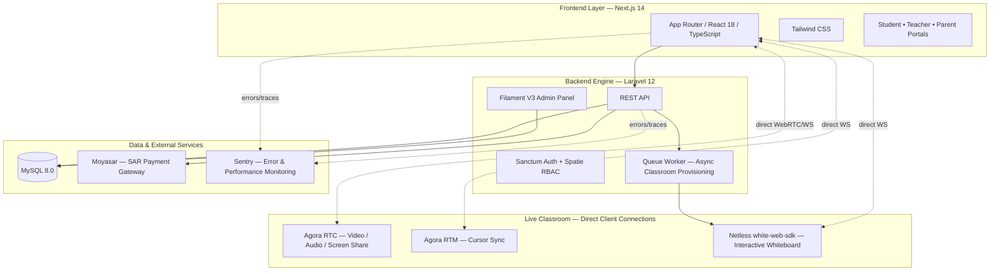

<div align="center">
  <a href="https://taj-backend-t4ki.onrender.com/" target="_blank" title="Go to Taj Platform">
    
  </a>

  <br />
  <br />

  <h1>Taj Educational Platform <br/> (منصة تاج التعليمية)</h1>

  <p>
    <b>A Production-Grade, Arabic-First E-Learning Marketplace for Live 1-on-1 Tutoring.</b>
  </p>

  <p>
    <a href="https://laravel.com"></a>
    <a href="https://nextjs.org"></a>
    <a href="https://www.typescriptlang.org"></a>
    <a href="https://filamentphp.com"></a>
    <a href="https://www.agora.io"></a>
    <a href="https://www.netless.link"></a>
    <a href="https://sentry.io"></a>
    <a href="https://www.docker.com"></a>
  </p>

  <p align="center" style="max-width: 800px; margin: 0 auto;">
    Taj connects students and parents in the MENA region with verified subject-specialist teachers for live, one-on-one tutoring. It ships with a fully-featured virtual classroom — HD video, adaptive screen sharing, and a real-time collaborative whiteboard — wrapped around a wallet-based economy with automated revenue splitting, built entirely with a native Arabic (RTL) experience.
  </p>
</div>

<br />

## 📖 Table of Contents

1. [🏗️ System Architecture](#️-system-architecture)
2. [🌐 Live Beta Access](#-live-beta-access)
3. [🆕 What's New](#-whats-new)
4. [✨ Key Features](#-key-features)
5. [🎓 Functional Requirements by Role](#-functional-requirements-by-role)
6. [🛠️ Technology Stack](#️-technology-stack)
7. [📊 Project Stats](#-project-stats)
8. [🚀 Getting Started](#-getting-started)
9. [🧪 Testing](#-testing)
10. [👤 Author](#-author)

---

## 🏗️ System Architecture

The platform is a decoupled monorepo: a Next.js presentation layer talks to a Laravel API over REST, while the virtual classroom (video, screen share, and whiteboard) connects directly, client-to-client, through Agora and Netless — keeping the API server free of media traffic.



---

## 🌐 Live Beta Access

- **🎓 Frontend (Students & Teachers)**: <a href="https://taj-platform.vercel.app/" target="_blank" rel="noopener noreferrer">Live Demo</a>
- **👑 Admin Dashboard Panel**: <a href="https://taj-backend-t4ki.onrender.com/admin/login" target="_blank" rel="noopener noreferrer">Admin Login</a>
- **⚙️ Backend API Base URL**: <a href="https://taj-backend-t4ki.onrender.com/" target="_blank" rel="noopener noreferrer">API Server</a>

---

## 🆕 What's New

Recent additions that take the platform beyond a basic booking-and-video app:

- **🖊️ Interactive Whiteboard** — A real-time collaborative whiteboard (Netless `white-web-sdk`) inside every classroom, with drawing tools, live cursor sync between teacher and student, and automatic reconnection on network drops.
- **📡 Adaptive Network Resilience** — A multi-layer video quality system that smooths out network quality readings, switches to a low-resolution simulcast stream automatically, re-encodes the outgoing video in real time (from 720p down to 120p), and prioritizes audio over video when bandwidth is critically low — all without interrupting the call.
- **🖥️ Isolated Screen Sharing** — Screen share runs on a fully separate media connection from the camera feed, so presenting a slide deck never competes with — or degrades — the main video call.
- **🛰️ Full-Stack Error & Performance Monitoring** — Sentry is wired into both the Laravel backend and the Next.js frontend, with custom breadcrumbs tracking the health of the classroom provisioning pipeline and whiteboard connection lifecycle.
- **💰 Automated Revenue Split** — Every completed session automatically credits the teacher's wallet with their share and retains the platform commission — no manual reconciliation required.

---

## ✨ Key Features

- 🔐 **Full RBAC** — Four distinct roles (Student, Teacher, Parent, Admin) via Spatie Permissions, each with its own dashboard and capabilities.
- 📹 **Live HD Video Tutoring** — Low-latency audio/video sessions via Agora RTC, with automatic token renewal mid-session.
- 🖊️ **Real-Time Interactive Whiteboard** — Synchronized drawing, shapes, and text between teacher and student powered by Netless.
- 🖥️ **Dedicated Screen Sharing** — Independent media channel so screen shares stay smooth regardless of camera bandwidth.
- 📅 **Race-Condition-Safe Booking** — Atomic, transaction-locked slot booking that makes double-booking the same time slot impossible.
- 💳 **Wallet-Based Economy** — A central wallet system for students, parents, and teachers, backed by an overdraft-proof transaction ledger.
- 💰 **Automated Payouts & Revenue Share** — Sessions automatically split earnings between teacher and platform on completion; teachers can request payouts to their bank account.
- 💵 **Moyasar Payment Integration** — Saudi-market payment gateway for wallet top-ups, with signed webhook verification and idempotent crediting.
- 👨‍👩‍👧 **Parent-Managed Sub-Accounts** — Parents can link multiple children, fund their wallets, and toggle independent booking permissions per child.
- ⭐ **Mandatory Review System** — Students are prompted to rate their teacher after every completed session.
- 👑 **Custom Admin Panel** — A fully Arabic-localized FilamentPHP dashboard for KYC verification, dispute resolution, refunds, and platform-wide analytics.
- 🌍 **100% Arabic, RTL-Native UI** — Every screen, label, and system notification is built RTL-first for the MENA region.
- 🛰️ **Production-Grade Monitoring** — Sentry error tracking and performance tracing across both frontend and backend.

---

## 🎓 Functional Requirements by Role

### 🌐 Common Features (All Users)

- Secure, token-based authentication (Laravel Sanctum) with rate-limited login/registration.
- Role-aware dashboards summarizing schedules, wallet balance, and notifications.
- Full transaction history for every wallet movement (top-ups, deductions, earnings, refunds).
- Native RTL Arabic interface throughout.

### 👨‍🎓 Student Features

- Search and filter teachers by subject, grade level, and availability.
- Book a session directly from a teacher's live calendar, paid instantly from wallet balance.
- Join a live classroom with video, audio, screen sharing, and the interactive whiteboard — no external app required.
- Rate and review the teacher after each completed session.

### 👨‍👩‍👧‍👦 Parent Features

- Create and manage multiple linked child (student) accounts.
- Top up the family wallet via Moyasar and allocate spending allowances per child.
- Grant or revoke a child's ability to book and pay for sessions independently.
- Monitor a child's schedule, attendance, and the reviews they've left.

### 👨‍🏫 Teacher Features

- Complete KYC onboarding by uploading identification and academic credentials for admin verification.
- Manage a weekly availability calendar for bookable slots.
- Host the virtual classroom: video, screen sharing, and full whiteboard drawing control.
- Automatically receive 80% of each session's payment directly into their wallet upon marking it complete, with the option to request payouts to a bank account.

### 🛡️ Admin (Super User) Features

- Review and verify (or reject) teacher KYC applications.
- Full visibility into all bookings, users, and platform-wide revenue — with retained platform commission tracked automatically.
- Process teacher payout requests and issue manual refunds.
- Manage the subject and grade-level catalog available across the platform.
- Monitor system health and error rates via the integrated Sentry dashboard.

---

## 🛠️ Technology Stack

### Backend (`/backend`)

> **Core:** Laravel 12.0 • PHP 8.3 • MySQL 8.0
> **Admin & Security:** Filament V3 • Laravel Sanctum • Spatie Permission
> **Real-Time & Media:** Agora RTC/RTM Token Generation • Netless Whiteboard REST API
> **Payments:** Moyasar Payment Gateway (SAR)
> **Monitoring:** Sentry (`sentry/sentry-laravel`)
> **Async Processing:** Laravel Queues (background classroom provisioning)

### Frontend (`/frontend`)

> **Core:** Next.js 14.2 (App Router) • React 18 • TypeScript
> **Styling & UI:** Tailwind CSS 3.4
> **Live Classroom:** `agora-rtc-sdk-ng` (video/audio/screen share) • `agora-rtm-sdk` (cursor sync) • `white-web-sdk` (interactive whiteboard)
> **Data & State:** TanStack Query • Axios
> **Monitoring:** `@sentry/nextjs`

---

## 📊 Project Stats

| Metric                   | Details                                              |
| :------------------------ | :---------------------------------------------------- |
| **🚀 Architecture**       | Monorepo (Next.js frontend + Laravel REST API)        |
| **🔐 Role Support**       | Admin, Teacher, Student, Parent                        |
| **📡 Video/Audio**        | Agora RTC — adaptive, simulcast-enabled                |
| **🖊️ Whiteboard**         | Netless `white-web-sdk` — real-time collaborative      |
| **💳 Payments**           | Moyasar (SAR, Saudi market)                             |
| **🛰️ Monitoring**         | Sentry — full-stack (backend + frontend)                |
| **🌍 Localization**       | 100% Arabic (RTL-native interface)                      |
| **🛡️ Security**           | Sanctum tokens + Spatie RBAC + rate limiting            |

---

## 🚀 Getting Started

The recommended way to boot up the complete Taj Platform stack (Frontend, Backend, and Database) is using **Docker Compose**.

### Prerequisites

- [Docker](https://docs.docker.com/get-docker/) & [Docker Compose](https://docs.docker.com/compose/install/)
- **Node.js 20+** (for local frontend development outside Docker)
- **PHP 8.3 & Composer** (for local backend development outside Docker)

### 1. Clone & Prepare

```bash
# Clone the repository
git clone https://github.com/Ammar-1993/Taj-Platform.git
cd Taj-Platform

# Copy environment files
cp backend/.env.example backend/.env
```

Configure the following in `backend/.env` before starting: database credentials, `AGORA_APP_ID` / `AGORA_APP_CERTIFICATE`, `WHITEBOARD_SDK_TOKEN`, `MOYASAR_PUBLISHABLE_KEY` / `MOYASAR_SECRET_KEY`, and `FRONTEND_URL`.

### 2. Ignite the Docker Environment

```bash
docker-compose up -d --build
```

> **What this spins up:**
>
> - 🗄️ **MySQL Engine** (Port `3307` mapped locally to `3306`, to avoid conflicts with existing local MySQL installs)
> - 🐘 **Laravel API Server** (Port `8000`)
> - ⚛️ **Next.js Client** (Port `3000`)

### 3. Backend Setup & Seeding

```bash
# Enter the Laravel container
docker-compose exec laravel.test bash

# Install dependencies and bootstrap the instance
composer install
php artisan key:generate

# Migrate and seed the database
php artisan migrate --seed
```

> ⚠️ Remember to run a queue worker (`php artisan queue:work`) — classroom provisioning (whiteboard room creation and token pre-generation) runs asynchronously through Laravel's queue system.

### Local Development Endpoints

- **Frontend App:** [http://localhost:3000](http://localhost:3000)
- **Backend API:** [http://localhost:8000/api](http://localhost:8000/api)
- **Filament Admin Panel:** [http://localhost:8000/admin](http://localhost:8000/admin)

---

## 🧪 Testing

**Backend (PHPUnit, Laravel's built-in testing suite):**

```bash
cd backend
php artisan test
```

**Frontend:**

```bash
cd frontend
npm run test
```

---

<div align="center">
  <br />
  <p>Developed with ❤️ by <b>Engineer Ammar Al-Najjar</b></p>
</div>