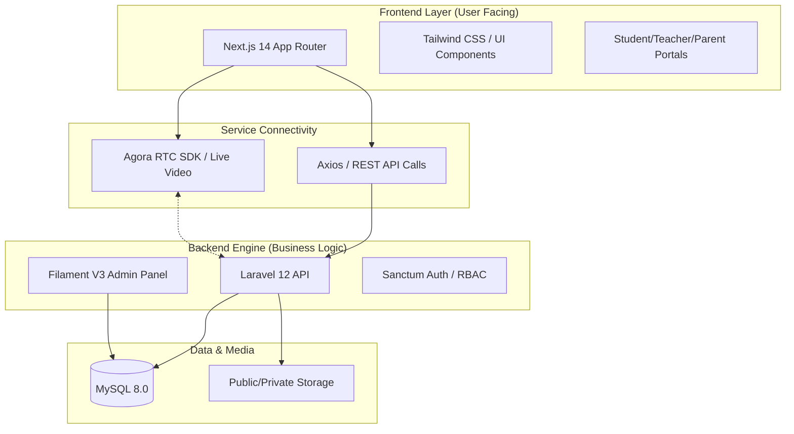

<div align="center">
  <a href="https://taj-backend-t4ki.onrender.com/" target="_blank" title="Go to Taj Platform">
    
  </a>

  <br />
  <br />

  <h1>Taj Educational Platform <br/> (منصة تاج التعليمية)</h1>
  
  <p>
    <b>The Ultimate Production-Ready App for Live Tutoring, Mentorship, and Academic Excellence.</b>
  </p>

  <p>
    <a href="https://laravel.com"></a>
    <a href="https://nextjs.org"></a>
    <a href="https://www.typescriptlang.org"></a>
    <a href="https://filamentphp.com"></a>
    <a href="https://tailwindcss.com"></a>
    <a href="https://www.docker.com"></a>
  </p>

  <p align="center" style="max-width: 800px; margin: 0 auto;">
    Taj Educational Platform is a state-of-the-art, multi-tenant e-learning ecosystem designed to bridge the gap between students and specialized educators. Powered by a high-performance REST API and a stunningly responsive Next.js frontend, it delivers low-latency live video sessions and a seamless educational experience.
  </p>
</div>

<br />

## 📖 Table of Contents

1. [📸 Project Showcase](#-project-showcase)
2. [🏗️ System Architecture](#️-system-architecture)
3. [🌐 Live Beta Access](#-live-beta-access)
4. [✨ Functional Requirements](#-functional-requirements-fr)
5. [🛠️ Technology Stack](#️-technology-stack)
6. [📊 Project Stats](#-project-stats)
7. [🚀 Getting Started](#-getting-started)
8. [🧪 Testing](#-testing)
9. [👤 Author](#-author)

---

## 🏗️ System Architecture

The following diagram illustrates the decoupled interaction between the **Next.js** presentation layer, the **Laravel** API heart, and the shared ecosystem services.


---

## 🌐 Live Beta Access

Explore the live environments hosted in our beta phase:

- **🎓 Frontend (Students & Teachers)**: <a href="https://taj-platform.vercel.app/" target="_blank" rel="noopener noreferrer">Live Demo</a>
- **👑 Admin Dashboard Panel**: <a href="https://taj-backend-t4ki.onrender.com/admin/login" target="_blank" rel="noopener noreferrer">Admin Login</a>
- **⚙️ Backend API Base URL**: <a href="https://taj-backend-t4ki.onrender.com/" target="_blank" rel="noopener noreferrer">API Server</a>

---

## ✨ Key Features

- 🔐 **Roles & Access Management:** Full RBAC using Spatie Permissions. Distinct portals for Students, Verified Teachers (e.g., Chemistry, Physics), and System Admins.
- 📹 **Live Video Tutoring:** Real-time, low-latency audio and video communication powered by robust **Agora RTC SDK**.
- 📅 **Smart Booking System:** Localized appointment scheduling enabling students to book subject matter experts efficiently.
- 👑 **Advanced Admin Dashboard:** A deeply customizable administration UI built on **FilamentPHP**, fully localized into Arabic with custom Taj branding (منصة تاج التعليمية).
- 🌍 **Full Localization & RTL Support:** Native Right-to-Left (RTL) interface modeling localized entirely in Arabic for the Middle Eastern audience.
- 🛡️ **Secure API & Authentication:** Token-based security and robust protected API endpoints handled seamlessly by **Laravel Sanctum**.

---

## ✨ Functional Requirements (FR)

The Taj Educational Platform is designed with a robust, multi-tenant architecture serving four distinct user roles. Below are the core functional requirements implemented to deliver a seamless educational and financial flow:

### 🌐 1. Common Features (All Users)

- **Centralized Authentication (RBAC):** Secure login and registration with Role-Based Access Control, ensuring users only access their designated interfaces.
- **Interactive Dashboards:** Personalized landing pages for each role summarizing statistics, upcoming schedules, and recent notifications.
- **Integrated Digital Wallet:** A unified wallet system allowing users to track current balances, view detailed transaction histories (top-ups, deductions, earnings, withdrawals), and manage funds safely.
- **Real-Time Notifications:** In-app alerts for new bookings, class reminders, and wallet updates.
- **Full Localization:** Native Right-to-Left (RTL) Arabic interface for optimal user experience in the MENA region.

### 👨‍🎓 2. Student Features

- **Advanced Discovery & Search:** Ability to browse and filter tutors based on subjects, ratings, and hourly rates.
- **Seamless Booking System:** Select available time slots from a teacher's calendar and pay instantly using wallet balance or direct gateway.
- **Interactive Virtual Classroom:** Seamless integration with WebRTC (Agora) for real-time video, audio, and screen-sharing sessions directly within the browser (No external app required).
- **Mandatory Review System:** Post-class pop-ups prompting students to rate and review teachers (1-5 stars) to maintain platform quality.

### 👨‍👩‍👧‍👦 3. Parent Features

- **Sub-Account Management:** Ability to create, link, and manage multiple student (children) accounts, specifying their educational levels.
- **Financial Oversight & Funding:** Top-up the main parental wallet via credit cards (Stripe/PayTabs) and transfer specific allowances to children's wallets for self-booking.
- **Booking Permissions:** Granular control to allow or restrict a child's ability to book and pay for sessions independently.
- **Academic Monitoring:** Track children's upcoming schedules, view attendance history, and monitor teacher evaluations.

### 👨‍🏫 4. Teacher Features

- **Automated KYC & Onboarding:** Secure portal to upload identity documents and academic certificates for admin verification before profile activation.
- **Dynamic Schedule Management:** Interactive calendar to define and update weekly availability slots and working hours.
- **Virtual Classroom Control:** Host privileges within the virtual room, including starting/ending the session, and screen sharing.
- **Earnings & Payouts:** Automated fund transfer (Escrow release) upon class completion, with the ability to submit withdrawal requests (Payouts) to personal bank accounts.

### 🛡️ 5. Admin (Super User) Features

- **Global Analytics Dashboard:** Real-time metrics on user growth, active bookings, and total platform revenue.
- **KYC & User Verification:** Review, approve, or reject teacher onboarding applications and verify uploaded credentials.
- **Comprehensive Financial Oversight:** Monitor all platform transactions, manage platform commission percentages, and process teacher payout requests (marking them as completed after bank transfer).
- **Dispute Resolution & Refunds:** Authority to intervene in user conflicts, cancel compromised bookings, and manually refund wallet balances.
- **Academic Content Management:** Dynamically add, edit, or remove educational levels and subjects available on the platform.

---

## 🛠️ Technology Stack

The project operates as a modern monorepo, decoupling the interactive presentation layer from the backend RESTful API services.

### Backend (`/backend`)

> **Core:** Laravel 12.0 • PHP 8.3 • MySQL 8.0 <br/>
> **Admin & Security:** Filament V3 • Laravel Sanctum • Spatie Permission <br/>
> **Testing:** PHPUnit / PestPHP

### Frontend (`/frontend`)

> **Core:** Next.js 14.2 (App Router) • React 18 • TypeScript <br/>
> **Styling & UI:** Tailwind CSS 3.4 • PostCSS <br/>
> **Real-time Engine:** Agora React UIKit • Agora RTC SDK <br/>
> **Testing:** Jest • React Testing Library

---

## 📊 Project Stats

| Metric                    | Details                               |
| :------------------------ | :------------------------------------ |
| **🚀 Stack Architecture** | Monorepo (Next.js + Laravel API)      |
| **🔐 Role Support**       | Super Admin, Student, Teacher, Parent |
| **📡 Streaming Service**  | WebRTC via Agora RTC (Global Edge)    |
| **🌍 RTL Localization**   | 100% Arabic (Full Interface)          |
| **🛡️ Security Layer**     | JWT/Sanctum + RBAC Persistence        |
| **📱 Responsiveness**     | Advanced Tailwind Grid (Mobile First) |

---

## 🚀 Getting Started

The recommended way to boot up the complete Taj Platform stack (Frontend, Backend, and Database) is using **Docker Compose**.

### Prerequisites

- [Docker](https://docs.docker.com/get-docker/) & [Docker Compose](https://docs.docker.com/compose/install/)
- **Node.js 20+** (For local frontend development outside Docker)
- **PHP 8.3 & Composer** (For local backend development outside Docker)

### 1. Clone & Prepare

```bash
# Clone the repository
git clone https://github.com/Ammar-1993/Taj-Platform.git
cd Taj-Platform

# Copy Environment Files
cp backend/.env.example backend/.env
# Note: Ensure you configure your Agora app credentials and Database settings in backend/.env
```

### 2. Ignite the Docker Environment

Our `docker-compose.yml` automates the bootup of all essential services.

```bash
docker-compose up -d --build
```

> **What this spins up:**
>
> - 🗄️ **MySQL Engine** (Port `3307` mapped locally to `3306`)
> - 🐘 **Laravel API Server** (Port `8000`)
> - ⚛️ **Next.js Client** (Port `3000`)

### 3. Backend Setup & Seeding

Execute these commands inside the `laravel.test` container terminal:

```bash
# Enter the Laravel container
docker-compose exec laravel.test bash

# Install dependencies and bootstrap the instance
composer install
php artisan key:generate

# Migrate and seed the database with initial verified teacher accounts
php artisan migrate --seed
```

#### Local Development Endpoints

- **Frontend App:** [http://localhost:3000](http://localhost:3000)
- **Backend API:** [http://localhost:8000/api](http://localhost:8000/api)
- **Filament Admin Panel:** [http://localhost:8000/admin](http://localhost:8000/admin)

---

## 🧪 Testing

Both applications uphold their isolated testing frameworks ensuring maximal reliability before shipping.

**Backend Tests (PHPUnit):**

```bash
cd backend
php artisan test
```

**Frontend Tests (Jest):**

```bash
cd frontend
npm run test
```

---

<div align="center">
  <br />
  <p>Developed by ❤️ <b>Engineer Ammar Al-Najjar</b></p>
</div>
