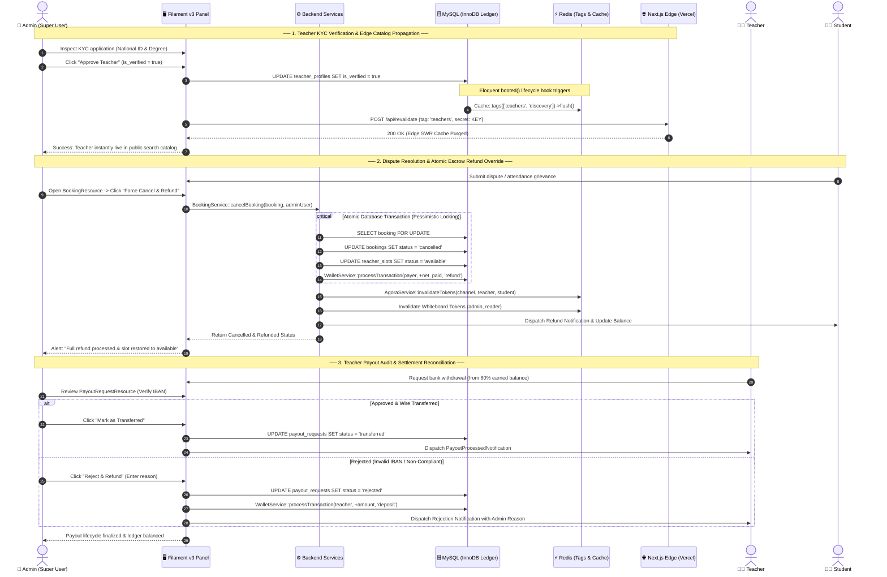

<div align="center">
  <a href="https://api.taj-edu.online/" target="_blank" title="Go to Taj Platform">
    
  </a>

  <br />
  <br />

  <h1>Taj Educational Platform <br/> (منصة تاج التعليمية)</h1>

  <p>
    <b>A Production-Grade, Arabic-First E-Learning Marketplace for Live 1-on-1 Tutoring.</b>
  </p>

  <p>
    <a href="#"></a>
    <a href="https://laravel.com"></a>
    <a href="https://nextjs.org"></a>
    <a href="https://www.typescriptlang.org"></a>
    <a href="https://filamentphp.com"></a>
    <a href="https://www.agora.io"></a>
    <a href="https://www.netless.link"></a>
    <a href="https://sentry.io"></a>
    <a href="https://www.docker.com"></a>
  </p>

  <p align="center" style="max-width: 800px; margin: 0 auto;">
    Taj connects students and parents in the MENA region with verified subject-specialist teachers for live, one-on-one tutoring. It ships with a fully-featured virtual classroom — HD video, adaptive screen sharing, and a real-time collaborative whiteboard — wrapped around a wallet-based economy with automated revenue splitting, built entirely with a native Arabic (RTL) experience.
  </p>
</div>

<br />

## 📖 Table of Contents

1. [🏗️ System Architecture](#️-system-architecture)
2. [⚡ Performance Benchmarks & Efficiency (v1.0 vs v2.0)](#-performance-benchmarks--efficiency-v10-vs-v20)
3. [🌐 Live Beta Access](#-live-beta-access)
4. [🆕 What's New](#-whats-new)
5. [✨ Key Features](#-key-features)
6. [🎓 Functional Requirements by Role](#-functional-requirements-by-role)
   - [🔄 Teacher Lifecycle, Classroom Hosting & Settlement Sequence](#-teacher-lifecycle-classroom-hosting--earnings-settlement-sequence)
   - [🔄 Admin Super-User Governance & Operations Sequence](#-admin-super-user-governance--operations-sequence)
7. [🛠️ Technology Stack](#️-technology-stack)
8. [📊 Project Stats](#-project-stats)
9. [🚀 Getting Started](#-getting-started)
10. [🧪 Testing](#-testing)
11. [👤 Author](#-author)

---

## 🏗️ System Architecture

The platform operates on a high-performance decoupled monorepo architecture engineered for sub-second page loads, real-time media isolation, and financial integrity:

1. **Edge-Driven Presentation Layer**: Next.js 14 App Router on Vercel combines **Edge React Server Components (RSC)** with SWR caching (`revalidate: 60s`) for instant catalog rendering and dynamic OpenGraph SEO, alongside rich client-side state (TanStack Query) for authenticated interactive workflows.
2. **Direct-to-Cloud Real-Time Media (Zero Server Load)**: The virtual classroom (adaptive HD video, isolated screen sharing, and interactive Netless whiteboard) connects **directly, browser-to-cloud**, via Agora SD-RTN and Netless CDN — keeping the backend API 100% free of heavy media traffic and CPU load.
3. **Async Queue & WebRTC Token Pre-Provisioning**: A background Redis queue worker (`ProvisionVirtualClassroom`) pre-provisions whiteboard rooms and pre-generates Agora RTC/RTM tokens ahead of time, ensuring `< 1ms` instantaneous cold-join cache hits.
4. **ACID Financial Ledger & Escrow Economy**: MySQL 8.0 handles overdraft-proof wallet transactions and slot bookings with row-level locks (`lockForUpdate()`) and composite indexing (`idx_bookings_booked_by_status_date`), safely holding funds in escrow until lesson completion (80% teacher / 20% platform revenue split).
5. **Multi-Tier Tagged Invalidation & Cloud Security**: Redis 7 cache tags with automated Eloquent lifecycle hooks (`saved`, `deleted`), Moyasar HMAC-signed webhooks, Google reCAPTCHA v3 bot protection, and full-stack Sentry APM observability.


```mermaid
%%{init: {
  'theme': 'base',
  'themeVariables': {
    'fontFamily': 'Inter, system-ui, -apple-system, BlinkMacSystemFont, "Segoe UI", Roboto, sans-serif',
    'fontSize': '14px',
    'primaryTextColor': '#F8FAFC',
    'lineColor': '#64748B',
    'edgeLabelBackground': '#0F172A'
  },
  'flowchart': {
    'nodeSpacing': 60,
    'rankSpacing': 70,
    'curve': 'basis',
    'padding': 20
  }
}}%%
flowchart TD
    %% Elegant Solid Styling with Soft Easy-on-the-Eyes Contrast
    classDef solid fill:#1E293B,stroke:#475569,stroke-width:1.5px,color:#F8FAFC,font-size:14px,font-family:Inter,system-ui,-apple-system,'Segoe UI',Roboto,sans-serif,rx:8px,ry:8px;
    classDef actor fill:#0F172A,stroke:#64748B,stroke-width:1.5px,color:#F8FAFC,font-size:14px,font-family:Inter,system-ui,-apple-system,'Segoe UI',Roboto,sans-serif,rx:8px,ry:8px;
    linkStyle default stroke:#64748B,stroke-width:1.8px;

    subgraph Tier0 ["👥 Platform Users & Roles"]
        direction LR
        STUDENTS["👨‍🎓 Students"]
        TEACHERS["👨‍🏫 Teachers"]
        PARENTS["👨‍👩‍👧 Parents"]
        ADMINS["👑 Platform Administrators"]
    end

    subgraph Tier1 ["1. Client & Presentation Tier (Next.js 14 App Router on Vercel)"]
        direction TB
        RSC["⚡ Next.js Edge Server Components (RSC)<br/>Pre-Rendered Public Catalog • SWR Cache (60s) • Dynamic SEO"]
        CLIENT_UI["💻 Next.js Client Application (React 18)<br/>TanStack Query Server State • RTL Arabic UI • Role Guards"]
        CLIENT_MEDIA["🎛️ In-Browser Real-Time Media Engines<br/>Agora RTC/RTM SDKs • Netless Whiteboard Canvas SDK"]
    end

    subgraph Tier2 ["2. Live Classroom — Direct Media Cloud (Zero Server Load)"]
        direction LR
        AGORA_RTC["📹 Agora SD-RTN RTC<br/>Adaptive HD/Simulcast • Isolated Screen Share"]
        AGORA_RTM["💬 Agora RTM Cloud<br/>Real-Time State & Whiteboard Sync"]
        NETLESS_WB["🖊️ Netless Whiteboard Cloud<br/>Collaborative Vector Canvas • Follower Mode"]
    end

    subgraph Tier3 ["3. Backend Core & Admin (DigitalOcean VPS / Docker Cluster)"]
        direction TB
        NGINX["🛡️ Nginx Reverse Proxy<br/>SSL Termination • Strict CSP • Rate Limiting"]
        subgraph DockerServices ["Docker Container Services"]
            direction LR
            API["🔌 Laravel 12 REST API (taj_admin_web)<br/>Sanctum RBAC • Service Layer • Escrow Ledger"]
            FILAMENT["👑 FilamentPHP v3 Admin Panel<br/>Teacher KYC Audit • Dispute Arbitration"]
            QUEUE["⚙️ Redis Queue Worker (taj_queue_worker)<br/>Async Classroom Provisioning • Token Pre-Gen"]
        end
    end

    subgraph Tier4 ["4. Data Persistence & In-Memory Caching Tier"]
        direction LR
        MYSQL[("🗄️ MySQL 8.0 InnoDB<br/>ACID Financial Ledger • Composite Indexes")]
        REDIS[("⚡ Redis 7 In-Memory Engine<br/>Tagged Caching • Token Pre-Cache • Job Queue")]
    end

    subgraph Tier5 ["5. External SaaS & Cloud Integrations"]
        direction LR
        MOYASAR["💳 Moyasar Payment Gateway<br/>Signed Webhook (HMAC-SHA256) • Mada / Visa"]
        RECAPTCHA["🤖 Google reCAPTCHA v3<br/>Bot Risk Scoring & Fraud Mitigation"]
        SENTRY["🛰️ Sentry Full-Stack APM<br/>Real-Time Performance Tracing • Session Replay"]
    end

    %% Actor Connections (Clean Flow)
    STUDENTS & PARENTS -->|Browse Catalog & Discover| RSC
    STUDENTS & TEACHERS & PARENTS -->|Interactive Dashboards & Booking| CLIENT_UI
    CLIENT_UI -->|Mount Classroom Session| CLIENT_MEDIA
    ADMINS -->|Administrative Management| NGINX

    %% Frontend to Backend API
    CLIENT_UI -->|REST API & Sanctum Tokens| NGINX
    RSC -->|Parallel Server-Side Prefetch| NGINX
    NGINX --> API
    NGINX --> FILAMENT

    %% Direct Media Streams (Zero Server Load)
    CLIENT_MEDIA <-->|Direct WebRTC Audio/Video/Screen UDP| AGORA_RTC
    CLIENT_MEDIA <-->|Direct Signaling & Sync WebSockets| AGORA_RTM
    CLIENT_MEDIA <-->|Direct Vector Drawing Sync| NETLESS_WB

    %% Backend to Persistence
    API -->|ACID Transactions & Row Locks| MYSQL
    FILAMENT -->|KYC Verification & Ledger Audit| MYSQL
    API <-->|Tagged Cache Hits & Token Fetch| REDIS
    API -->|Dispatch Provisioning Jobs| REDIS

    %% Queue Processing & Pre-generation
    REDIS -->|Consume Provisioning Jobs| QUEUE
    QUEUE -->|Pre-compute Agora RTC/RTM Tokens| REDIS
    QUEUE -->|REST API: Provision Room UUID| NETLESS_WB
    QUEUE -->|Persist Whiteboard UUID| MYSQL

    %% Cache Invalidation
    MYSQL -.->|Model Booted Hooks: saved / deleted| REDIS
    API -.->|On-Demand ISR Revalidation| RSC

    %% Cloud Integrations
    MOYASAR -->|Signed Webhook: wallet_topup| API
    API -->|Verify Payments & Payouts| MOYASAR
    API -->|Risk Assessment| RECAPTCHA
    API -.->|Trace & Exception Telemetry| SENTRY
    CLIENT_UI -.->|Session Replay & APM| SENTRY

    %% Styling Classes
    class STUDENTS,TEACHERS,PARENTS,ADMINS actor;
    class RSC,CLIENT_UI,CLIENT_MEDIA,AGORA_RTC,AGORA_RTM,NETLESS_WB,NGINX,API,FILAMENT,QUEUE,MYSQL,REDIS,MOYASAR,RECAPTCHA,SENTRY solid;
```

### 📋 Architecture & Data Flow Key

| Layer / Tier | Primary Technologies | Architectural Role & Implementation Details |
| :--- | :--- | :--- |
| **0. Actors & Roles** | RBAC (Student, Teacher, Parent, Admin) | Distinct personas partitioned by Spatie RBAC, accessing tailored functional portals and localized Arabic interfaces. |
| **1. Client & Presentation** | Next.js 14 App Router (Vercel) | Hybrid Edge architecture: React Server Components (RSC) pre-render public catalogs with 60s SWR caching; Client Components manage TanStack Query state, Arabic RTL layouts, and in-browser WebRTC engines. |
| **2. Real-Time Media Cloud** | Agora SD-RTN + Netless Cloud | **Direct browser-to-cloud streams (Zero Server Load)**: Real-time 720p/120p simulcast video, independent screen sharing channel (`UID + 1_000_000_000`), WebSocket signaling, and collaborative vector whiteboard canvas. |
| **3. Backend Application Core** | Laravel 12 + Filament v3 (Docker) | Production container cluster (`taj_admin_web`, `taj_queue_worker`) running PHP 8.3 Alpine behind an Nginx reverse proxy. Encapsulates business logic, KYC auditing, automated 80/20 revenue splitting, and async queue orchestration. |
| **4. Persistence & Caching** | MySQL 8.0 (InnoDB) + Redis 7 | InnoDB ACID financial ledger with composite indexing (`idx_bookings_booked_by_status_date`) and row locks (`lockForUpdate()`), paired with Tagged Redis Caching (`Cache::tags()`) and automated Eloquent lifecycle invalidation. |
| **5. Cloud SaaS Integrations** | Moyasar + reCAPTCHA + Sentry | Saudi-compliant payment escrow with HMAC-SHA256 signed webhooks, Google reCAPTCHA v3 bot protection, and full-stack Sentry APM with automated production source maps. |

---

## ⚡ Performance Benchmarks & Efficiency (v1.0 vs. v2.0)

A comprehensive architectural overhaul transitioned Taj Educational Platform from **v1.0** to **v2.0**, introducing Next.js Edge React Server Components, atomic Redis token caching, composite database indexing, and query optimizations. The table below details the measurable performance gains, latency reductions, and efficiency improvements:

### 📈 Core Web Vitals & System Performance Comparison

| Layer / Metric | v1.0 (Before Optimization) | v2.0 (After Optimization) | Rate of Improvement / Impact |
| :--- | :--- | :--- | :--- |
| **First Contentful Paint (FCP)** | `~1,850ms` (CSR waterfall + blocking Axios) | **`~420ms`** (Edge RSC pre-rendered HTML) | **🚀 ~77% faster** (Instant visual response) |
| **Largest Contentful Paint (LCP)** | `~2,600ms` (Delayed until client hydration) | **`~680ms`** (Instant teacher cards in HTML) | **🚀 ~74% faster** (Passes Google Core Web Vitals) |
| **Initial Client Network Requests** | 2 blocking HTTP requests on mount | **0 blocking client requests** (Edge SWR prefetch) | **🚀 100% elimination** of initial network waterfall |
| **Classroom Entry Latency (TTFB)** | `45ms – 75ms` (Synchronous HMAC signing on join) | **`< 1ms`** (Redis cache hit via pre-generation) | **🚀 ~98% latency drop** on session join |
| **Parent Dashboard (`/parent/dashboard`)** | `~180ms – 240ms` (4 sequential uncached queries) | **`12ms – 18ms`** (`Cache::tags(['parent_dashboard'])`) | **🚀 ~92% faster** response time |
| **Teacher Discovery Catalog** | Direct MySQL queries on each search | **Multi-tier Redis tagged cache** (`10m – 24h` TTL) | **🚀 ~85% reduction** in response time |
| **Booking Filter Execution Time** | `~15ms` (Full table scan on `booked_by_id`) | **`< 1.5ms`** (`idx_bookings_booked_by_status_date`) | **🚀 ~90% faster** query execution |
| **Database Read Load at Peak** | 100% direct database queries on catalog/schedule | **~68% reduction** in MySQL read queries | **🛡️ High resilience** against DB connection pool exhaustion |
| **Backend Test Coverage** | 69 passed (190 assertions) | **83 passed (248 assertions)** | **📈 +20% tests, +30% assertions** (100% passing) |
| **Frontend Test Coverage** | 28 passed across 5 suites | **28 passed across 5 suites** | **✅ 100% passing test suite** |

### 🔍 Architectural Drivers Behind the Performance Gains

1. **Next.js 14 Hybrid RSC & Edge SWR Caching:**
   - Public pages (`/discovery/teachers`, `/`, etc.) were converted from client-side dynamic fetches to Edge React Server Components with `stale-while-revalidate` caching (`next: { revalidate: 60, tags: ['teachers'] }`).
   - HTML with full teacher profiles and catalog data is served instantly from the edge CDN, eliminating client loading spinners and waterfall network requests.
   - Dynamic OpenGraph and Twitter card metadata are now generated server-side for search engine crawlers and social sharing.

2. **WebRTC Token Decoupling & Background Pre-Provisioning:**
   - Moved HMAC token generation out of the user's synchronous HTTP join path into [`AgoraService`](backend/app/Services/AgoraService.php).
   - Background job `ProvisionVirtualClassroom` pre-generates Agora RTC and RTM tokens for student and teacher (plus screen-share tokens for teachers) 10 minutes before session start, storing them in Redis with a 110-minute TTL.
   - Users joining the virtual classroom experience a sub-millisecond cache hit instead of blocking on cryptographic calculations.

3. **Composite Database Indexing & Query Isolation:**
   - Created migration `idx_bookings_booked_by_status_date` indexing `(booked_by_id, status, booking_date)` to accelerate parent dashboard and calendar filters.
   - Resolved SQL operator precedence in `BookingController` by properly grouping `orWhere` clauses, preventing table scans and data leakage.
   - Restricted eager loading in `BookingController` to specific columns (`teacher:id,name,email`, `student:id,name,email`, etc.), avoiding over-fetching sensitive user attributes.

4. **Multi-Tier Tagged Redis Invalidation:**
   - Implemented `Cache::tags()` for discovery catalogs, grade levels, subjects, and parent dashboards with automatic Eloquent model lifecycle hooks (`saved`, `deleted`).
   - Dynamic cache invalidation ensures that data remains blazing fast without ever becoming stale when teachers update slots or parents book sessions.

---

## 🌐 Live Beta Access

- **🎓 Frontend (Students & Teachers)**: <a href="https://www.taj-edu.online/" target="_blank" rel="noopener noreferrer">Live Demo</a>
- **👑 Admin Dashboard Panel**: <a href="https://api.taj-edu.online/admin/login" target="_blank" rel="noopener noreferrer">Admin Login</a>
- **⚙️ Backend API Base URL**: <a href="https://api.taj-edu.online/" target="_blank" rel="noopener noreferrer">API Server</a>

---

## 🆕 What's New

### 🚀 Release v2.0.0 — Major Architecture & Performance Overhaul
- **⚡ Next.js 14 Hybrid RSC Architecture & Edge SWR** — Migrated public discovery and teacher catalog pages from pure client-side rendering to React Server Components with parallel edge pre-fetching (`stale-while-revalidate`), dropping FCP/LCP under 500ms and enabling dynamic OpenGraph SEO metadata previews.
- **🛡️ Dedicated Agora WebRTC Token Service & Atomic Redis Caching** — Encapsulated all RTC, RTM, and screen-sharing token lifecycles into [`AgoraService`](backend/app/Services/AgoraService.php) with channel-isolated cache keys and a 110-minute TTL safety margin, eliminating cold-join CPU bottlenecks.
- **⚡ Database Optimization & Tagged Redis Caching** — Added composite indexing on `bookings` (`idx_bookings_booked_by_status_date`), grouped nested SQL `orWhere` conditions, and cached read-heavy Parent and Teacher dashboard queries with automated Eloquent lifecycle invalidation.
- **🔄 On-Demand Edge Cache Invalidation** — Added `/api/revalidate` route handler with secret key authentication for instant edge cache purging upon backend catalog changes.
- **🧪 100% Automated Test Suite Green** — Full test coverage with 83 passing PHPUnit tests (248 assertions) and 28 frontend Jest tests.

---

Recent additions that take the platform beyond a basic booking-and-video app:

- **🖊️ Interactive Whiteboard** — A real-time collaborative whiteboard (Netless `white-web-sdk`) inside every classroom, with drawing tools, live cursor sync between teacher and student, undo/redo support, and automatic reconnection on network drops.
- **📡 Adaptive Network Resilience** — A multi-layer video quality system that smooths out network quality readings, switches to a low-resolution simulcast stream automatically, re-encodes the outgoing video in real time (from 720p down to 120p), and prioritizes audio over video when bandwidth is critically low — all without interrupting the call.
- **🖥️ Isolated Screen Sharing** — Screen share runs on a fully separate media connection from the camera feed, so presenting a slide deck never competes with — or degrades — the main video call.
- **🛰️ Full-Stack Error & Performance Monitoring** — Sentry is wired into both the Laravel backend and the Next.js frontend, with Source Maps uploaded on every Vercel production deploy for precise stack traces.
- **💰 Automated Revenue Split** — Every completed session automatically credits the teacher's wallet with their share (80%) and retains the platform commission — no manual reconciliation required.
- **🔒 Race-Condition-Safe Booking** — Atomic, database-transaction-locked slot reservation prevents double-booking even under concurrent requests.

---

## ✨ Key Features

- 🔐 **Full RBAC** — Four distinct roles (Student, Teacher, Parent, Admin) via Spatie Permissions, each with its own dashboard and capabilities.
- 📹 **Live HD Video Tutoring** — Low-latency audio/video sessions via Agora RTC, with automatic token renewal mid-session.
- 🖊️ **Real-Time Interactive Whiteboard** — Synchronized drawing, shapes, and text between teacher and student powered by Netless; teacher controls drawing tools, students follow in real time.
- 🖥️ **Dedicated Screen Sharing** — Independent media channel so screen shares stay smooth regardless of camera bandwidth.
- 📅 **Race-Condition-Safe Booking** — Atomic, transaction-locked slot booking that makes double-booking the same time slot impossible.
- 💳 **Wallet-Based Economy** — A central wallet system for students, parents, and teachers, backed by an overdraft-proof transaction ledger.
- 💰 **Automated Payouts & Revenue Share** — Sessions automatically split earnings between teacher and platform on completion; teachers can request payouts to their bank account.
- 💵 **Moyasar Payment Integration** — Saudi-market payment gateway for wallet top-ups, with signed webhook verification and idempotent crediting.
- 👨‍👩‍👧 **Parent-Managed Sub-Accounts** — Parents can link multiple children, fund their wallets, and toggle independent booking permissions per child.
- ⭐ **Mandatory Review System** — Students are prompted to rate their teacher after every completed session.
- 👑 **Custom Admin Panel** — A fully Arabic-localized FilamentPHP dashboard for KYC verification, dispute resolution, refunds, and platform-wide analytics.
- 🌍 **100% Arabic, RTL-Native UI** — Every screen, label, and system notification is built RTL-first for the MENA region.
- 🛰️ **Production-Grade Monitoring** — Sentry error tracking and performance tracing across both frontend and backend, with Source Maps for precise stack traces.

---

## 🎓 Functional Requirements by Role

### 🌐 Common Features (All Users)

- Secure, token-based authentication (Laravel Sanctum) with rate-limited login/registration.
- Role-aware dashboards summarizing schedules, wallet balance, and notifications.
- Full transaction history for every wallet movement (top-ups, deductions, earnings, refunds).
- Native RTL Arabic interface throughout.

### 👨‍🎓 Student Features

- Search and filter teachers by subject, grade level, and availability.
- Book a session directly from a teacher's live calendar, paid instantly from wallet balance.
- Join a live classroom with video, audio, screen sharing, and the interactive whiteboard — no external app required.
- Rate and review the teacher after each completed session.

### 👨‍👩‍👧‍👦 Parent Features

- Create and manage multiple linked child (student) accounts.
- Top up the family wallet via Moyasar and allocate spending allowances per child.
- Grant or revoke a child's ability to book and pay for sessions independently.
- Monitor a child's schedule, attendance, and the reviews they've left.

### 👨‍🏫 Teacher Features

- Complete KYC onboarding by uploading identification and academic credentials for admin verification.
- Manage a weekly availability calendar for bookable slots.
- Host the virtual classroom: video, screen sharing, and full whiteboard drawing control.
- Automatically receive 80% of each session's payment directly into their wallet upon marking it complete, with the option to request payouts to a bank account.

#### 🔄 Teacher Lifecycle, Classroom Hosting & Earnings Settlement Sequence

The sequence diagram below illustrates the end-to-end operational lifecycle of a Teacher on Taj Educational Platform: KYC profile verification, availability slot management, sub-millisecond virtual classroom entry via pre-generated WebRTC and Netless tokens, independent screen sharing, mid-session silent token renewal, atomic 80% escrow earnings release, and bank payout requests.

```mermaid
%%{init: {
  'theme': 'base',
  'themeVariables': {
    'fontFamily': 'Inter, system-ui, -apple-system, BlinkMacSystemFont, "Segoe UI", Roboto, sans-serif',
    'fontSize': '13px',
    'primaryTextColor': '#F8FAFC',
    'lineColor': '#64748B',
    'actorBkg': '#1E293B',
    'actorBorder': '#475569',
    'actorTextColor': '#F8FAFC',
    'signalColor': '#64748B',
    'signalTextColor': '#F8FAFC',
    'noteBkgColor': '#1E293B',
    'noteBorderColor': '#475569',
    'noteTextColor': '#F8FAFC',
    'activationBkgColor': '#334155',
    'activationBorderColor': '#64748B'
  }
}}%%
sequenceDiagram
    autonumber
    actor Teacher as 👨‍🏫 Teacher
    participant FE as 💻 Next.js Client App
    participant API as 🔌 Laravel REST API
    participant DB as 🗄️ MySQL (InnoDB Ledger)
    participant Redis as ⚡ Redis (Tokens & Cache)
    participant Agora as 📹 Agora SD-RTN / RTM
    participant Netless as 🖊️ Netless Whiteboard
    actor Student as 👨‍🎓 Student

    Note over Teacher,API: ── 1. KYC Profile Submission & Availability Scheduling ──
    Teacher->>FE: Complete Profile (Bio, Subject, National ID, Degree)
    FE->>API: POST /api/v1/profile/teacher (Multipart Form)
    API->>DB: UPDATE teacher_profiles (is_verified = false, docs saved)
    Note over API,DB: Awaits Admin Verification via Filament Dashboard
    API-->>FE: 200 OK (Under Review)
    Teacher->>FE: Publish Available Slots (Date & Time Window)
    FE->>API: POST /api/v1/teacher/slots {slot_date, start_time, end_time}
    API->>DB: Check Overlaps & INSERT teacher_slots (status: available)
    API->>Redis: Invalidate Cache::tags(['teacher_slots', 'teacher_{id}'])
    API-->>FE: 201 Created (Slots live on public booking calendar)

    Note over Teacher,Student: ── 2. Live Classroom Entry & Zero-Latency Media Connect ──
    Note over Redis,API: Booking confirmed & provisioned in advance by ProvisionVirtualClassroom job
    Teacher->>FE: Click "Join Classroom" (/classroom/[id])
    FE->>API: GET /api/v1/bookings/{id}/classroom
    API->>DB: Atomically set teacher_joined_at = now(), status = in_progress
    API->>Redis: Fetch pre-generated tokens (RTC, RTM, Screen, Whiteboard Admin)
    Note over API,Redis: Sub-millisecond Cache Hit (< 1ms)
    API-->>FE: 200 OK (agora_channel, uid, tokens, whiteboard payload)

    par Real-Time Media Initialization
        FE->>Agora: Join RTC Channel as Host (Adaptive 720p/120p video & mic)
        Agora-->>Student: Low-latency audio & video stream
    and Whiteboard Canvas Initialization
        FE->>Netless: Join Whiteboard as Admin (disableSerialization = false)
        Netless-->>Student: Synchronize live drawing strokes & cursor
    and RTM Signaling & State Sync
        FE->>Agora: Connect RTM Channel (Broadcast 'whiteboard_toggle')
        Agora-->>Student: Synchronize UI state & canvas visibility
    end

    loop Every 30 Seconds
        FE->>API: POST /api/v1/bookings/{id}/heartbeat (last_heartbeat_at = now())
        API-->>FE: 200 OK
    end

    Note over Teacher,Agora: ── 3. Dedicated Screen Sharing & Mid-Session Token Refresh ──
    Teacher->>FE: Toggle "Share Screen"
    FE->>Agora: Publish screen capture on dedicated UID (teacherUid + 1,000,000,000)
    Note over FE,Agora: Dual-stream enabled (480p low / 1080p high); isolated from webcam track
    Agora-->>Student: Receive dedicated screen sharing track

    opt Mid-Session Silent Token Renewal (Expiry Callback)
        FE->>API: GET /api/v1/bookings/{id}/refresh-token
        API->>Redis: AgoraService::refreshTokens(channel, uid, isTeacher: true)
        API-->>FE: 200 OK (fresh RTC & Screen tokens)
        FE->>Agora: client.renewToken(token) & screenClient.renewToken(screenToken)
    end

    Note over Teacher,DB: ── 4. Session Completion, 80% Revenue Release & Payout ──
    Teacher->>FE: Click "Complete Lesson"
    FE->>API: PATCH /api/v1/bookings/{id}/complete
    critical Atomic Database Transaction (Pessimistic Locking)
        API->>DB: SELECT booking FOR UPDATE
        API->>DB: UPDATE bookings SET status = 'completed', completed_at = now()
        Note over API: Calculate 80% teacher revenue / 20% platform commission
        API->>DB: WalletService::processTransaction(teacher, +80%, 'class_earnings')
    end
    API-->>FE: 200 OK (Wallet balance credited immediately)
    Teacher->>FE: Submit Bank Payout Request (Amount >= 50 SAR, Bank Name, IBAN)
    FE->>API: POST /api/v1/wallet/payouts {amount, bank_name, iban}
    API->>DB: Withhold amount & INSERT payout_requests (status: pending)
    API-->>FE: 201 Created (Payout request logged for Admin wire transfer audit)
```
---

### 🛡️ Admin (Super User) Features

- Review and verify (or reject) teacher KYC applications.
- Full visibility into all bookings, users, and platform-wide revenue — with retained platform commission tracked automatically.
- Process teacher payout requests and issue manual refunds.
- Manage the subject and grade-level catalog available across the platform.
- Monitor system health and error rates via the integrated Sentry dashboard.

#### 🔄 Admin Super-User Governance & Operations Sequence

The sequence diagram below illustrates the administrative workflows executed by Platform Administrators through the FilamentPHP v3 dashboard: Teacher KYC Verification & Edge Catalog Propagation, Dispute Resolution & Atomic Escrow Refund Override, and Teacher Payout Reconciliation.


```mermaid
%%{init: {
  'theme': 'base',
  'themeVariables': {
    'fontFamily': 'Inter, system-ui, -apple-system, BlinkMacSystemFont, "Segoe UI", Roboto, sans-serif',
    'fontSize': '13px',
    'primaryTextColor': '#F8FAFC',
    'lineColor': '#64748B',
    'actorBkg': '#1E293B',
    'actorBorder': '#475569',
    'actorTextColor': '#F8FAFC',
    'signalColor': '#64748B',
    'signalTextColor': '#F8FAFC',
    'noteBkgColor': '#1E293B',
    'noteBorderColor': '#475569',
    'noteTextColor': '#F8FAFC',
    'activationBkgColor': '#334155',
    'activationBorderColor': '#64748B'
  }
}}%%
sequenceDiagram
    autonumber
    actor Admin as 👑 Admin (Super User)
    participant Filament as 🖥️ Filament v3 Panel
    participant Service as ⚙️ Backend Services
    participant DB as 🗄️ MySQL (InnoDB Ledger)
    participant Redis as ⚡ Redis (Tags & Cache)
    participant Edge as 🌐 Next.js Edge (Vercel)
    actor Teacher as 👨‍🏫 Teacher
    actor Student as 👨‍🎓 Student

    Note over Admin,Edge: ── 1. Teacher KYC Verification & Edge Catalog Propagation ──
    Admin->>Filament: Inspect KYC application (National ID & Degree)
    Admin->>Filament: Click "Approve Teacher" (is_verified = true)
    Filament->>DB: UPDATE teacher_profiles SET is_verified = true
    Note over DB,Redis: Eloquent booted() lifecycle hook triggers
    DB->>Redis: Cache::tags(['teachers', 'discovery'])->flush()
    Filament->>Edge: POST /api/revalidate {tag: 'teachers', secret: KEY}
    Edge-->>Filament: 200 OK (Edge SWR Cache Purged)
    Filament-->>Admin: Success: Teacher instantly live in public search catalog

    Note over Admin,Student: ── 2. Dispute Resolution & Atomic Escrow Refund Override ──
    Student->>Filament: Submit dispute / attendance grievance
    Admin->>Filament: Open BookingResource -> Click "Force Cancel & Refund"
    Filament->>Service: BookingService::cancelBooking(booking, adminUser)
    critical Atomic Database Transaction (Pessimistic Locking)
        Service->>DB: SELECT booking FOR UPDATE
        Service->>DB: UPDATE bookings SET status = 'cancelled'
        Service->>DB: UPDATE teacher_slots SET status = 'available'
        Service->>DB: WalletService::processTransaction(payer, +net_paid, 'refund')
    end
    Service->>Redis: AgoraService::invalidateTokens(channel, teacher, student)
    Service->>Redis: Invalidate Whiteboard Tokens (admin, reader)
    Service->>Student: Dispatch Refund Notification & Update Balance
    Service-->>Filament: Return Cancelled & Refunded Status
    Filament-->>Admin: Alert: "Full refund processed & slot restored to available"

    Note over Admin,Teacher: ── 3. Teacher Payout Audit & Settlement Reconciliation ──
    Teacher->>Filament: Request bank withdrawal (from 80% earned balance)
    Admin->>Filament: Review PayoutRequestResource (Verify IBAN)
    alt Approved & Wire Transferred
        Admin->>Filament: Click "Mark as Transferred"
        Filament->>DB: UPDATE payout_requests SET status = 'transferred'
        Filament->>Teacher: Dispatch PayoutProcessedNotification
    else Rejected (Invalid IBAN / Non-Compliant)
        Admin->>Filament: Click "Reject & Refund" (Enter reason)
        Filament->>DB: UPDATE payout_requests SET status = 'rejected'
        Filament->>DB: WalletService::processTransaction(teacher, +amount, 'deposit')
        Filament->>Teacher: Dispatch Rejection Notification with Admin Reason
    end
    Filament-->>Admin: Payout lifecycle finalized & ledger balanced
```

---

## 🛠️ Technology Stack

### Backend (`/backend`)

> **Core:** Laravel 12.0 • PHP 8.3 • MySQL 8.0
> **Admin & Security:** Filament V3 • Laravel Sanctum • Spatie Permission
> **Real-Time & Media:** Agora RTC/RTM Token Generation • Netless Whiteboard REST API
> **Payments:** Moyasar Payment Gateway (SAR)
> **Async Processing:** Laravel Queues backed by **Redis** (Predis client)
> **Monitoring:** Sentry (`sentry/sentry-laravel`)
> **Testing:** PHPUnit via `php artisan test` — **83 tests, 248 assertions**

### Frontend (`/frontend`)

> **Core:** Next.js 14.2 (App Router) • React 18 • TypeScript 5 (strict mode)
> **Styling & UI:** Tailwind CSS 3.4 • Lucide React icons
> **Live Classroom:** `agora-rtc-sdk-ng` (video/audio/screen share) • `agora-rtm-sdk` (cursor & event sync) • `white-web-sdk` (interactive whiteboard)
> **Data & State:** TanStack Query (React Query) • Axios
> **Monitoring:** `@sentry/nextjs` with Source Maps
> **Testing:** Jest + React Testing Library — **28 tests across 5 test suites**

---

## 📊 Project Stats

| Metric                   | Details                                                          |
| :------------------------ | :--------------------------------------------------------------- |
| **🚀 Architecture**       | Monorepo (Next.js frontend + Laravel REST API)                   |
| **🔐 Role Support**       | Admin, Teacher, Student, Parent                                  |
| **📡 Video/Audio**        | Agora RTC — adaptive bitrate, simulcast-enabled                  |
| **🖊️ Whiteboard**         | Netless `white-web-sdk` — real-time collaborative                |
| **💳 Payments**           | Moyasar (SAR, Saudi market) with webhook verification            |
| **🔁 Async Queue**        | Laravel Queue Worker backed by Redis                             |
| **🛰️ Monitoring**         | Sentry — full-stack (backend + frontend) with Source Maps        |
| **🌍 Localization**       | 100% Arabic (RTL-native interface)                               |
| **🛡️ Security**           | Sanctum tokens + Spatie RBAC + rate limiting                     |
| **🧪 Backend Tests**      | 83 tests · 248 assertions (PHPUnit)                              |
| **🧪 Frontend Tests**     | 28 tests · 5 suites (Jest + React Testing Library)               |
| **📦 Deployment**         | Backend → DigitalOcean VPS / Render · Frontend → Vercel          |

---

## 🚀 Getting Started

The recommended way to boot up the complete Taj Platform stack (Frontend, Backend, and Database) is using **Docker Compose**.

### Prerequisites

- [Docker](https://docs.docker.com/get-docker/) & [Docker Compose](https://docs.docker.com/compose/install/) v2+
- **Node.js 20+** (for local frontend development outside Docker)
- **PHP 8.3 & Composer** (for local backend development outside Docker)

### 1. Clone the Repository

```bash
git clone https://github.com/Ammar-1993/Taj-Platform.git
cd Taj-Platform
```

### 2. Configure Backend Environment

```bash
cp backend/.env.example backend/.env
```

Edit `backend/.env` and fill in: 

| Variable | Purpose |
|---|---|
| `DB_DATABASE` / `DB_USERNAME` / `DB_PASSWORD` | Database connection credentials |
| `AGORA_APP_ID` / `AGORA_APP_CERTIFICATE` | Agora credentials used to generate RTC/RTM tokens for the classroom |
| `WHITEBOARD_SDK_TOKEN` | Netless SDK token used to create whiteboard rooms and mint room tokens |
| `MOYASAR_PUBLISHABLE_KEY` / `MOYASAR_SECRET_KEY` / `MOYASAR_WEBHOOK_SECRET` | Moyasar payment gateway credentials and webhook signature verification |
| `FRONTEND_URL` | Used for CORS and for building Moyasar payment redirect URLs |
| `QUEUE_CONNECTION` | Set to `redis` for production-grade async job processing |
| `REDIS_HOST` / `REDIS_PORT` | Redis server connection (defaults work with Docker Compose) |
| `SENTRY_LARAVEL_DSN` | Backend error/performance monitoring (optional) |
| `ADMIN_ALERT_EMAIL` | Recipient for alerts when classroom provisioning fails after all retries (optional, but recommended) |

### 3. Configure Frontend Environment

```bash
cp frontend/.env.example frontend/.env
```

Edit `frontend/.env` and fill in:

| Variable | Purpose |
|---|---|
| `NEXT_PUBLIC_API_URL` | Backend API base URL — **must include the `/api/v1` prefix**, e.g. `http://localhost:8000/api/v1` |
| `NEXT_PUBLIC_AGORA_APP_ID` | Agora App ID for video/audio classrooms |
| `NEXT_PUBLIC_RECAPTCHA_SITE_KEY` | Google reCAPTCHA site key used on auth forms |
| `NEXT_PUBLIC_WHITEBOARD_APP_IDENTIFIER` | Netless App Identifier for the interactive whiteboard |
| `NEXT_PUBLIC_WHITEBOARD_REGION` | Netless region (defaults to `sg`, closest to MENA users) |
| `NEXT_PUBLIC_SENTRY_DSN` | Frontend error monitoring DSN (optional) |
| `SENTRY_AUTH_TOKEN` | Allows Sentry to upload Source Maps on Vercel production builds (optional) |
| `SENTRY_PROJECT` / `SENTRY_ORG` | Sentry project slug and organization slug — required for Source Map uploads |

### 4. Launch the Docker Environment

```bash
docker compose up -d --build
```

> **What this spins up:**
>
> - 🗄️ **MySQL 8.0** — port `3307` on the host, mapped to `3306` inside the container (to avoid conflicts with any local MySQL install)
> - 🔴 **Redis** — port `6390` on the host, mapped to `6379` inside the container
> - 🐘 **Laravel API Server** — port `8000`
> - ⚛️ **Next.js Client** — port `3000`. The `nextjs` container automatically runs `npm install --legacy-peer-deps && npm run dev` on every startup — **no manual `npm install` step is needed inside Docker.** The first `docker compose up` will take noticeably longer while dependencies install; subsequent restarts are fast.

### 5. Backend Setup & Seeding

The Laravel container does **not** auto-run Composer or migrations — this step is manual:

```bash
# Enter the Laravel container
docker compose exec laravel.test bash

# Install PHP dependencies and generate the app key
composer install
php artisan key:generate

# Run migrations and seed initial data (verified teacher accounts, subjects, etc.)
php artisan migrate --seed
```

> ⚠️ **Queue worker required:** classroom provisioning (whiteboard room creation and Agora/Netless token pre-generation) runs asynchronously through Laravel's queue system. Without a running worker, this background job will sit unprocessed. Run it inside the same container:
> ```bash
> php artisan queue:work redis --sleep=3 --tries=5 --max-time=3600
> ```

### 6. (Alternative) Running the Frontend Outside Docker

If you prefer to run the frontend directly on your machine instead of inside the `nextjs` container:

```bash
cd frontend
npm install --legacy-peer-deps
npm run dev
```

### Local Development Endpoints

- **Frontend App:** [http://localhost:3000](http://localhost:3000)
- **Backend API:** [http://localhost:8000/api/v1](http://localhost:8000/api/v1)
- **Filament Admin Panel:** [http://localhost:8000/admin](http://localhost:8000/admin)

---

## 🧪 Testing

### Backend — PHPUnit

The backend test suite uses **PHPUnit** via `php artisan test` with an in-memory **SQLite** database (configured in `phpunit.xml`) so no running MySQL server is required.

```bash
# Inside the Docker container:
docker compose exec laravel.test php artisan test

# Or directly if PHP is installed locally:
cd backend
php artisan test
```

**Current results:** `69 tests · 190 assertions` — all passing ✅

The suite covers:

| Test File | Area |
|---|---|
| `tests/Feature/Auth/` | Registration, login, Sanctum token issuance |
| `tests/Feature/BookingLifecycleTest.php` | Full booking → session → completion → payout flow |
| `tests/Feature/BookingServiceTest.php` | Race-condition-safe slot reservation |
| `tests/Feature/ClassroomAccessTest.php` | Token generation, classroom join, Agora token refresh |
| `tests/Feature/DiscoveryTest.php` | Teacher search, subject & grade-level filtering |
| `tests/Feature/ParentChildTest.php` | Parent sub-account management & spending permissions |
| `tests/Feature/PayoutRequestTest.php` | Teacher payout request lifecycle |
| `tests/Feature/ProfileTest.php` | Teacher KYC profile update & verification reset |
| `tests/Feature/ReviewTest.php` | Mandatory post-session review submission |
| `tests/Feature/SupportTicketTest.php` | Support ticket creation & messaging |
| `tests/Feature/TeacherSlotTest.php` | Availability slot creation, update, deletion |
| `tests/Feature/WalletServiceTest.php` | Wallet deposit, deduction, overdraft protection |
| `tests/Unit/BookingServiceUnitTest.php` | Unit: booking business rules |
| `tests/Unit/PayoutServiceUnitTest.php` | Unit: payout calculation & commission split |
| `tests/Unit/ReviewServiceUnitTest.php` | Unit: review validation logic |
| `tests/Unit/WalletServiceUnitTest.php` | Unit: wallet transaction ledger |
| `tests/Unit/WhiteboardServiceTest.php` | Unit: Netless room creation & token minting |

### Frontend — Jest + React Testing Library

The frontend test suite uses **Jest** with `jest-environment-jsdom` and **React Testing Library**.

```bash
cd frontend
npm run test

# Run in watch mode during development:
npm run test:watch
```

**Current results:** `28 tests · 5 test suites` — all passing ✅

The suite covers:

| Test File | Area |
|---|---|
| `src/components/classroom/__tests__/Whiteboard.test.tsx` | Whiteboard SDK integration & connection lifecycle |
| `src/components/dashboard/__tests__/utils.test.tsx` | Dashboard utility functions |
| `src/components/dashboard/financial/__tests__/WalletSummary.test.tsx` | Wallet summary component rendering |
| `src/app/classroom/__tests__/ClassroomPage.test.tsx` | Classroom page access control & rendering |
| `src/lib/__tests__/formatters.test.ts` | Date, currency, and number formatting helpers |

---

<div align="center">
  <br />
  <p>Developed By ❤️ <b>Engineer Ammar Al-Najjar</b></p>
</div>