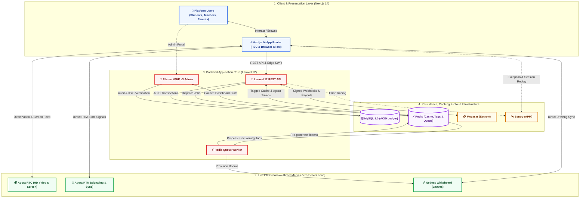

<div align="center">
  <a href="https://api.taj-edu.online/" target="_blank" title="Go to Taj Platform">
    
  </a>

  <br />
  <br />

  <h1>Taj Educational Platform <br/> (منصة تاج التعليمية)</h1>

  <p>
    <b>A Production-Grade, Arabic-First E-Learning Marketplace for Live 1-on-1 Tutoring.</b>
  </p>

  <p>
    <a href="#"></a>
    <a href="https://laravel.com"></a>
    <a href="https://nextjs.org"></a>
    <a href="https://www.typescriptlang.org"></a>
    <a href="https://filamentphp.com"></a>
    <a href="https://www.agora.io"></a>
    <a href="https://www.netless.link"></a>
    <a href="https://sentry.io"></a>
    <a href="https://www.docker.com"></a>
  </p>

  <p align="center" style="max-width: 800px; margin: 0 auto;">
    Taj connects students and parents in the MENA region with verified subject-specialist teachers for live, one-on-one tutoring. It ships with a fully-featured virtual classroom — HD video, adaptive screen sharing, and a real-time collaborative whiteboard — wrapped around a wallet-based economy with automated revenue splitting, built entirely with a native Arabic (RTL) experience.
  </p>
</div>

<br />

## 📖 Table of Contents

1. [🏗️ System Architecture](#️-system-architecture)
2. [🌐 Live Beta Access](#-live-beta-access)
3. [🆕 What's New](#-whats-new)
4. [✨ Key Features](#-key-features)
5. [🎓 Functional Requirements by Role](#-functional-requirements-by-role)
6. [🛠️ Technology Stack](#️-technology-stack)
7. [📊 Project Stats](#-project-stats)
8. [🚀 Getting Started](#-getting-started)
9. [🧪 Testing](#-testing)
10. [👤 Author](#-author)

---

## 🏗️ System Architecture

The platform operates on a high-performance decoupled monorepo architecture engineered for sub-second page loads, real-time media isolation, and financial integrity:

1. **Hybrid Frontend Layer**: Next.js 14 App Router utilizes **Edge React Server Components (RSC)** with Stale-While-Revalidate (SWR) caching for instant public catalog rendering, while delegating interactive state and real-time media SDKs to the client browser.
2. **Direct-to-Cloud Media (Zero Server Load)**: The virtual classroom (HD video, adaptive screen sharing, and interactive whiteboard) connects **directly, browser-to-provider**, through Agora and Netless — keeping the API server 100% free of heavy media traffic.
3. **Async Queue & Token Pre-Generation**: A Redis queue worker pre-provisions virtual classrooms and pre-generates Agora RTC/RTM tokens in background jobs, achieving instantaneous classroom access (< 1ms cache hits).
4. **Multi-Tier Persistence & Caching**: MySQL 8.0 manages ACID ledger transactions with composite indexes, paired with a Redis caching layer utilizing cache tags and automated Eloquent lifecycle invalidation.


```mermaid
flowchart TD
    %% Custom Styling for High Contrast and Maximum Readability
    classDef client fill:#EFF6FF,stroke:#2563EB,stroke-width:2.5px,color:#1E3A8A,font-size:15px,font-weight:bold;
    classDef media fill:#F0FDF4,stroke:#16A34A,stroke-width:2.5px,color:#14532D,font-size:15px,font-weight:bold;
    classDef backend fill:#FEF2F2,stroke:#DC2626,stroke-width:2.5px,color:#7F1D1D,font-size:15px,font-weight:bold;
    classDef data fill:#FAF5FF,stroke:#9333EA,stroke-width:2.5px,color:#581C87,font-size:15px,font-weight:bold;
    classDef cloud fill:#FFFBEB,stroke:#D97706,stroke-width:2.5px,color:#78350F,font-size:15px,font-weight:bold;

    subgraph Tier1 ["1. Client & Presentation Layer (Next.js 14)"]
        direction LR
        USERS["👥 Platform Users (Students, Teachers, Parents)"]
        FE["⚡ Next.js 14 App Router (RSC & Browser Client)"]
    end

    subgraph Tier2 ["2. Live Classroom — Direct Media (Zero Server Load)"]
        direction LR
        RTC["📹 Agora RTC (HD Video & Screen)"]
        RTM["💬 Agora RTM (Signaling & Sync)"]
        WB["🖊️ Netless Whiteboard (Canvas)"]
    end

    subgraph Tier3 ["3. Backend Application Core (Laravel 12)"]
        direction LR
        API["🔌 Laravel 12 REST API"]
        ADMIN["👑 FilamentPHP v3 Admin"]
        QUEUE["⚡ Redis Queue Worker"]
    end

    subgraph Tier4 ["4. Persistence, Caching & Cloud Infrastructure"]
        direction LR
        DB[("🗄️ MySQL 8.0 (ACID Ledger)")]
        REDIS[("⚡ Redis (Cache, Tags & Queue)")]
        PAY["💳 Moyasar (Escrow)"]
        MON["🛰️ Sentry (APM)"]
    end

    %% User Interaction
    USERS -->|Interact / Browse| FE
    USERS -.->|Admin Portal| ADMIN

    %% Direct Media Streams (Browser to Cloud)
    FE <-->|Direct Video & Screen Feed| RTC
    FE <-->|Direct RTM State Signals| RTM
    FE <-->|Direct Drawing Sync| WB

    %% API Communication
    FE -->|REST API & Edge SWR| API

    %% Core Data & Caching Operations
    API -->|ACID Transactions| DB
    ADMIN -->|Audit & KYC Verification| DB
    API <-->|Tagged Cache & Agora Tokens| REDIS
    ADMIN <-->|Cached Dashboard Stats| REDIS
    API -->|Dispatch Jobs| REDIS
    REDIS -->|Process Provisioning Jobs| QUEUE
    QUEUE -->|Pre-generate Tokens| REDIS
    QUEUE -->|Provision Rooms| WB

    %% Cloud Integrations
    API <-->|Signed Webhooks & Payouts| PAY
    API -.->|Error Tracing| MON
    FE -.->|Exception & Session Replay| MON

    %% Class Bindings
    class USERS,FE client;
    class RTC,RTM,WB media;
    class API,ADMIN,QUEUE backend;
    class DB,REDIS data;
    class PAY,MON cloud;
```

### 📋 Architecture & Data Flow Key

| Layer / Stream | Primary Technology | Architectural Role & Purpose |
| :--- | :--- | :--- |
| **Client & Edge** | Next.js 14 App Router (Vercel) | Hybrid rendering: Edge React Server Components (RSC) with SWR for catalog pages, paired with client-side React Query state for authenticated user interactions. |
| **Live Classroom** | Agora RTC + Agora RTM + Netless | **Direct browser-to-provider streaming**: High-definition video, adaptive low-bandwidth simulcast, and whiteboard sync connect directly to cloud CDNs, imposing zero media I/O on the backend server. |
| **Application Core** | Laravel 12 + Sanctum + Spatie | Stateless REST API, role-based authorization (RBAC), and automated escrow calculations (80% teacher / 20% platform revenue split). |
| **Background Queue** | Laravel Queue Worker + Redis | Asynchronous virtual classroom provisioning (`ProvisionVirtualClassroom`), pre-computing Agora RTC/RTM tokens and Netless room UUIDs ahead of session start. |
| **Persistence & Cache**| MySQL 8.0 + Redis | Two-tier architecture: InnoDB ACID ledger with composite indexes for bookings and wallets, alongside Tagged Redis Caching for catalog, schedule, and dashboard data. |
| **Cloud Services** | Moyasar + Sentry + reCAPTCHA | Seamless Saudi Mada/Visa escrow payments, full-stack APM tracing with source maps, and bot protection on registration forms. |

---

## 🌐 Live Beta Access

- **🎓 Frontend (Students & Teachers)**: <a href="https://www.taj-edu.online/" target="_blank" rel="noopener noreferrer">Live Demo</a>
- **👑 Admin Dashboard Panel**: <a href="https://api.taj-edu.online/admin/login" target="_blank" rel="noopener noreferrer">Admin Login</a>
- **⚙️ Backend API Base URL**: <a href="https://api.taj-edu.online/" target="_blank" rel="noopener noreferrer">API Server</a>

---

## 🆕 What's New

### 🚀 Release v2.0.0 — Major Architecture & Performance Overhaul
- **⚡ Next.js 14 Hybrid RSC Architecture & Edge SWR** — Migrated public discovery and teacher catalog pages from pure client-side rendering to React Server Components with parallel edge pre-fetching (`stale-while-revalidate`), dropping FCP/LCP under 500ms and enabling dynamic OpenGraph SEO metadata previews.
- **🛡️ Dedicated Agora WebRTC Token Service & Atomic Redis Caching** — Encapsulated all RTC, RTM, and screen-sharing token lifecycles into [`AgoraService`](backend/app/Services/AgoraService.php) with channel-isolated cache keys and a 110-minute TTL safety margin, eliminating cold-join CPU bottlenecks.
- **⚡ Database Optimization & Tagged Redis Caching** — Added composite indexing on `bookings` (`idx_bookings_booked_by_status_date`), grouped nested SQL `orWhere` conditions, and cached read-heavy Parent and Teacher dashboard queries with automated Eloquent lifecycle invalidation.
- **🔄 On-Demand Edge Cache Invalidation** — Added `/api/revalidate` route handler with secret key authentication for instant edge cache purging upon backend catalog changes.
- **🧪 100% Automated Test Suite Green** — Full test coverage with 83 passing PHPUnit tests (248 assertions) and 28 frontend Jest tests.

---

Recent additions that take the platform beyond a basic booking-and-video app:

- **🖊️ Interactive Whiteboard** — A real-time collaborative whiteboard (Netless `white-web-sdk`) inside every classroom, with drawing tools, live cursor sync between teacher and student, undo/redo support, and automatic reconnection on network drops.
- **📡 Adaptive Network Resilience** — A multi-layer video quality system that smooths out network quality readings, switches to a low-resolution simulcast stream automatically, re-encodes the outgoing video in real time (from 720p down to 120p), and prioritizes audio over video when bandwidth is critically low — all without interrupting the call.
- **🖥️ Isolated Screen Sharing** — Screen share runs on a fully separate media connection from the camera feed, so presenting a slide deck never competes with — or degrades — the main video call.
- **🛰️ Full-Stack Error & Performance Monitoring** — Sentry is wired into both the Laravel backend and the Next.js frontend, with Source Maps uploaded on every Vercel production deploy for precise stack traces.
- **💰 Automated Revenue Split** — Every completed session automatically credits the teacher's wallet with their share (80%) and retains the platform commission — no manual reconciliation required.
- **🔒 Race-Condition-Safe Booking** — Atomic, database-transaction-locked slot reservation prevents double-booking even under concurrent requests.

---

## ✨ Key Features

- 🔐 **Full RBAC** — Four distinct roles (Student, Teacher, Parent, Admin) via Spatie Permissions, each with its own dashboard and capabilities.
- 📹 **Live HD Video Tutoring** — Low-latency audio/video sessions via Agora RTC, with automatic token renewal mid-session.
- 🖊️ **Real-Time Interactive Whiteboard** — Synchronized drawing, shapes, and text between teacher and student powered by Netless; teacher controls drawing tools, students follow in real time.
- 🖥️ **Dedicated Screen Sharing** — Independent media channel so screen shares stay smooth regardless of camera bandwidth.
- 📅 **Race-Condition-Safe Booking** — Atomic, transaction-locked slot booking that makes double-booking the same time slot impossible.
- 💳 **Wallet-Based Economy** — A central wallet system for students, parents, and teachers, backed by an overdraft-proof transaction ledger.
- 💰 **Automated Payouts & Revenue Share** — Sessions automatically split earnings between teacher and platform on completion; teachers can request payouts to their bank account.
- 💵 **Moyasar Payment Integration** — Saudi-market payment gateway for wallet top-ups, with signed webhook verification and idempotent crediting.
- 👨‍👩‍👧 **Parent-Managed Sub-Accounts** — Parents can link multiple children, fund their wallets, and toggle independent booking permissions per child.
- ⭐ **Mandatory Review System** — Students are prompted to rate their teacher after every completed session.
- 👑 **Custom Admin Panel** — A fully Arabic-localized FilamentPHP dashboard for KYC verification, dispute resolution, refunds, and platform-wide analytics.
- 🌍 **100% Arabic, RTL-Native UI** — Every screen, label, and system notification is built RTL-first for the MENA region.
- 🛰️ **Production-Grade Monitoring** — Sentry error tracking and performance tracing across both frontend and backend, with Source Maps for precise stack traces.

---

## 🎓 Functional Requirements by Role

### 🌐 Common Features (All Users)

- Secure, token-based authentication (Laravel Sanctum) with rate-limited login/registration.
- Role-aware dashboards summarizing schedules, wallet balance, and notifications.
- Full transaction history for every wallet movement (top-ups, deductions, earnings, refunds).
- Native RTL Arabic interface throughout.

### 👨‍🎓 Student Features

- Search and filter teachers by subject, grade level, and availability.
- Book a session directly from a teacher's live calendar, paid instantly from wallet balance.
- Join a live classroom with video, audio, screen sharing, and the interactive whiteboard — no external app required.
- Rate and review the teacher after each completed session.

### 👨‍👩‍👧‍👦 Parent Features

- Create and manage multiple linked child (student) accounts.
- Top up the family wallet via Moyasar and allocate spending allowances per child.
- Grant or revoke a child's ability to book and pay for sessions independently.
- Monitor a child's schedule, attendance, and the reviews they've left.

### 👨‍🏫 Teacher Features

- Complete KYC onboarding by uploading identification and academic credentials for admin verification.
- Manage a weekly availability calendar for bookable slots.
- Host the virtual classroom: video, screen sharing, and full whiteboard drawing control.
- Automatically receive 80% of each session's payment directly into their wallet upon marking it complete, with the option to request payouts to a bank account.

### 🛡️ Admin (Super User) Features

- Review and verify (or reject) teacher KYC applications.
- Full visibility into all bookings, users, and platform-wide revenue — with retained platform commission tracked automatically.
- Process teacher payout requests and issue manual refunds.
- Manage the subject and grade-level catalog available across the platform.
- Monitor system health and error rates via the integrated Sentry dashboard.

---

## 🛠️ Technology Stack

### Backend (`/backend`)

> **Core:** Laravel 12.0 • PHP 8.3 • MySQL 8.0
> **Admin & Security:** Filament V3 • Laravel Sanctum • Spatie Permission
> **Real-Time & Media:** Agora RTC/RTM Token Generation • Netless Whiteboard REST API
> **Payments:** Moyasar Payment Gateway (SAR)
> **Async Processing:** Laravel Queues backed by **Redis** (Predis client)
> **Monitoring:** Sentry (`sentry/sentry-laravel`)
> **Testing:** PHPUnit via `php artisan test` — **69 tests, 190 assertions**

### Frontend (`/frontend`)

> **Core:** Next.js 14.2 (App Router) • React 18 • TypeScript 5 (strict mode)
> **Styling & UI:** Tailwind CSS 3.4 • Lucide React icons
> **Live Classroom:** `agora-rtc-sdk-ng` (video/audio/screen share) • `agora-rtm-sdk` (cursor & event sync) • `white-web-sdk` (interactive whiteboard)
> **Data & State:** TanStack Query (React Query) • Axios
> **Monitoring:** `@sentry/nextjs` with Source Maps
> **Testing:** Jest + React Testing Library — **28 tests across 5 test suites**

---

## 📊 Project Stats

| Metric                   | Details                                                          |
| :------------------------ | :--------------------------------------------------------------- |
| **🚀 Architecture**       | Monorepo (Next.js frontend + Laravel REST API)                   |
| **🔐 Role Support**       | Admin, Teacher, Student, Parent                                  |
| **📡 Video/Audio**        | Agora RTC — adaptive bitrate, simulcast-enabled                  |
| **🖊️ Whiteboard**         | Netless `white-web-sdk` — real-time collaborative                |
| **💳 Payments**           | Moyasar (SAR, Saudi market) with webhook verification            |
| **🔁 Async Queue**        | Laravel Queue Worker backed by Redis                             |
| **🛰️ Monitoring**         | Sentry — full-stack (backend + frontend) with Source Maps        |
| **🌍 Localization**       | 100% Arabic (RTL-native interface)                               |
| **🛡️ Security**           | Sanctum tokens + Spatie RBAC + rate limiting                     |
| **🧪 Backend Tests**      | 69 tests · 190 assertions (PHPUnit)                              |
| **🧪 Frontend Tests**     | 28 tests · 5 suites (Jest + React Testing Library)               |
| **📦 Deployment**         | Backend → DigitalOcean VPS / Render · Frontend → Vercel          |

---

## 🚀 Getting Started

The recommended way to boot up the complete Taj Platform stack (Frontend, Backend, and Database) is using **Docker Compose**.

### Prerequisites

- [Docker](https://docs.docker.com/get-docker/) & [Docker Compose](https://docs.docker.com/compose/install/) v2+
- **Node.js 20+** (for local frontend development outside Docker)
- **PHP 8.3 & Composer** (for local backend development outside Docker)

### 1. Clone the Repository

```bash
git clone https://github.com/Ammar-1993/Taj-Platform.git
cd Taj-Platform
```

### 2. Configure Backend Environment

```bash
cp backend/.env.example backend/.env
```

Edit `backend/.env` and fill in: 

| Variable | Purpose |
|---|---|
| `DB_DATABASE` / `DB_USERNAME` / `DB_PASSWORD` | Database connection credentials |
| `AGORA_APP_ID` / `AGORA_APP_CERTIFICATE` | Agora credentials used to generate RTC/RTM tokens for the classroom |
| `WHITEBOARD_SDK_TOKEN` | Netless SDK token used to create whiteboard rooms and mint room tokens |
| `MOYASAR_PUBLISHABLE_KEY` / `MOYASAR_SECRET_KEY` / `MOYASAR_WEBHOOK_SECRET` | Moyasar payment gateway credentials and webhook signature verification |
| `FRONTEND_URL` | Used for CORS and for building Moyasar payment redirect URLs |
| `QUEUE_CONNECTION` | Set to `redis` for production-grade async job processing |
| `REDIS_HOST` / `REDIS_PORT` | Redis server connection (defaults work with Docker Compose) |
| `SENTRY_LARAVEL_DSN` | Backend error/performance monitoring (optional) |
| `ADMIN_ALERT_EMAIL` | Recipient for alerts when classroom provisioning fails after all retries (optional, but recommended) |

### 3. Configure Frontend Environment

```bash
cp frontend/.env.example frontend/.env
```

Edit `frontend/.env` and fill in:

| Variable | Purpose |
|---|---|
| `NEXT_PUBLIC_API_URL` | Backend API base URL — **must include the `/api/v1` prefix**, e.g. `http://localhost:8000/api/v1` |
| `NEXT_PUBLIC_AGORA_APP_ID` | Agora App ID for video/audio classrooms |
| `NEXT_PUBLIC_RECAPTCHA_SITE_KEY` | Google reCAPTCHA site key used on auth forms |
| `NEXT_PUBLIC_WHITEBOARD_APP_IDENTIFIER` | Netless App Identifier for the interactive whiteboard |
| `NEXT_PUBLIC_WHITEBOARD_REGION` | Netless region (defaults to `sg`, closest to MENA users) |
| `NEXT_PUBLIC_SENTRY_DSN` | Frontend error monitoring DSN (optional) |
| `SENTRY_AUTH_TOKEN` | Allows Sentry to upload Source Maps on Vercel production builds (optional) |
| `SENTRY_PROJECT` / `SENTRY_ORG` | Sentry project slug and organization slug — required for Source Map uploads |

### 4. Launch the Docker Environment

```bash
docker compose up -d --build
```

> **What this spins up:**
>
> - 🗄️ **MySQL 8.0** — port `3307` on the host, mapped to `3306` inside the container (to avoid conflicts with any local MySQL install)
> - 🔴 **Redis** — port `6390` on the host, mapped to `6379` inside the container
> - 🐘 **Laravel API Server** — port `8000`
> - ⚛️ **Next.js Client** — port `3000`. The `nextjs` container automatically runs `npm install --legacy-peer-deps && npm run dev` on every startup — **no manual `npm install` step is needed inside Docker.** The first `docker compose up` will take noticeably longer while dependencies install; subsequent restarts are fast.

### 5. Backend Setup & Seeding

The Laravel container does **not** auto-run Composer or migrations — this step is manual:

```bash
# Enter the Laravel container
docker compose exec laravel.test bash

# Install PHP dependencies and generate the app key
composer install
php artisan key:generate

# Run migrations and seed initial data (verified teacher accounts, subjects, etc.)
php artisan migrate --seed
```

> ⚠️ **Queue worker required:** classroom provisioning (whiteboard room creation and Agora/Netless token pre-generation) runs asynchronously through Laravel's queue system. Without a running worker, this background job will sit unprocessed. Run it inside the same container:
> ```bash
> php artisan queue:work redis --sleep=3 --tries=5 --max-time=3600
> ```

### 6. (Alternative) Running the Frontend Outside Docker

If you prefer to run the frontend directly on your machine instead of inside the `nextjs` container:

```bash
cd frontend
npm install --legacy-peer-deps
npm run dev
```

### Local Development Endpoints

- **Frontend App:** [http://localhost:3000](http://localhost:3000)
- **Backend API:** [http://localhost:8000/api/v1](http://localhost:8000/api/v1)
- **Filament Admin Panel:** [http://localhost:8000/admin](http://localhost:8000/admin)

---

## 🧪 Testing

### Backend — PHPUnit

The backend test suite uses **PHPUnit** via `php artisan test` with an in-memory **SQLite** database (configured in `phpunit.xml`) so no running MySQL server is required.

```bash
# Inside the Docker container:
docker compose exec laravel.test php artisan test

# Or directly if PHP is installed locally:
cd backend
php artisan test
```

**Current results:** `69 tests · 190 assertions` — all passing ✅

The suite covers:

| Test File | Area |
|---|---|
| `tests/Feature/Auth/` | Registration, login, Sanctum token issuance |
| `tests/Feature/BookingLifecycleTest.php` | Full booking → session → completion → payout flow |
| `tests/Feature/BookingServiceTest.php` | Race-condition-safe slot reservation |
| `tests/Feature/ClassroomAccessTest.php` | Token generation, classroom join, Agora token refresh |
| `tests/Feature/DiscoveryTest.php` | Teacher search, subject & grade-level filtering |
| `tests/Feature/ParentChildTest.php` | Parent sub-account management & spending permissions |
| `tests/Feature/PayoutRequestTest.php` | Teacher payout request lifecycle |
| `tests/Feature/ProfileTest.php` | Teacher KYC profile update & verification reset |
| `tests/Feature/ReviewTest.php` | Mandatory post-session review submission |
| `tests/Feature/SupportTicketTest.php` | Support ticket creation & messaging |
| `tests/Feature/TeacherSlotTest.php` | Availability slot creation, update, deletion |
| `tests/Feature/WalletServiceTest.php` | Wallet deposit, deduction, overdraft protection |
| `tests/Unit/BookingServiceUnitTest.php` | Unit: booking business rules |
| `tests/Unit/PayoutServiceUnitTest.php` | Unit: payout calculation & commission split |
| `tests/Unit/ReviewServiceUnitTest.php` | Unit: review validation logic |
| `tests/Unit/WalletServiceUnitTest.php` | Unit: wallet transaction ledger |
| `tests/Unit/WhiteboardServiceTest.php` | Unit: Netless room creation & token minting |

### Frontend — Jest + React Testing Library

The frontend test suite uses **Jest** with `jest-environment-jsdom` and **React Testing Library**.

```bash
cd frontend
npm run test

# Run in watch mode during development:
npm run test:watch
```

**Current results:** `28 tests · 5 test suites` — all passing ✅

The suite covers:

| Test File | Area |
|---|---|
| `src/components/classroom/__tests__/Whiteboard.test.tsx` | Whiteboard SDK integration & connection lifecycle |
| `src/components/dashboard/__tests__/utils.test.tsx` | Dashboard utility functions |
| `src/components/dashboard/financial/__tests__/WalletSummary.test.tsx` | Wallet summary component rendering |
| `src/app/classroom/__tests__/ClassroomPage.test.tsx` | Classroom page access control & rendering |
| `src/lib/__tests__/formatters.test.ts` | Date, currency, and number formatting helpers |

---

<div align="center">
  <br />
  <p>Developed By ❤️ <b>Engineer Ammar Al-Najjar</b></p>
</div>