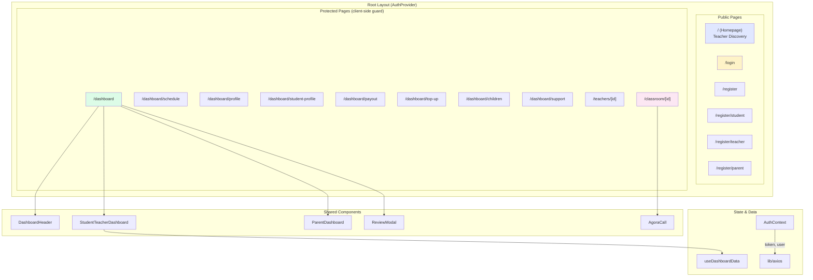

# 👑 Taj Platform — Deep-Dive Frontend Architecture Analysis

> **Scope:** All 15 pages, 7 components, 2 hooks, 3 lib files, 1 type module, 2 test files  
> **Total Frontend LOC:** ~2,850 lines across 22 source files  
> **Framework:** Next.js 14.2 (App Router) • TypeScript • Tailwind CSS 3.4 • Agora RTC

---

## 1. Complete File Inventory & Size Map

Every source file in the frontend, ordered by size (largest = most complexity/debt):

| # | File | Lines | Size | Purpose |
|:---:|---|:---:|:---:|---|
| 1 | [StudentTeacherDashboard.tsx](file:///root/taj-platform/frontend/src/components/dashboard/StudentTeacherDashboard.tsx) | 353 | 16.0KB | Main dashboard for students & teachers |
| 2 | [classroom/[id]/page.tsx](file:///root/taj-platform/frontend/src/app/classroom/[id]/page.tsx) | 259 | 12.9KB | Live Agora video session |
| 3 | [schedule/page.tsx](file:///root/taj-platform/frontend/src/app/dashboard/schedule/page.tsx) | 252 | 9.9KB | Teacher slot management |
| 4 | [payout/page.tsx](file:///root/taj-platform/frontend/src/app/dashboard/payout/page.tsx) | 223 | 12.9KB | Teacher payout requests |
| 5 | [teachers/[id]/page.tsx](file:///root/taj-platform/frontend/src/app/teachers/[id]/page.tsx) | 214 | 8.8KB | Teacher detail + booking |
| 6 | [support/page.tsx](file:///root/taj-platform/frontend/src/app/dashboard/support/page.tsx) | 213 | 12.1KB | Support ticket system |
| 7 | [page.tsx (home)](file:///root/taj-platform/frontend/src/app/page.tsx) | 191 | 11.5KB | Homepage — teacher discovery |
| 8 | [ParentDashboard.tsx](file:///root/taj-platform/frontend/src/components/dashboard/ParentDashboard.tsx) | 183 | 8.3KB | Parent dashboard component |
| 9 | [profile/page.tsx](file:///root/taj-platform/frontend/src/app/dashboard/profile/page.tsx) | 182 | 9.8KB | Teacher profile + doc upload |
| 10 | [children/page.tsx](file:///root/taj-platform/frontend/src/app/dashboard/children/page.tsx) | 178 | 10.7KB | Parent child management |
| 11 | [student/page.tsx](file:///root/taj-platform/frontend/src/app/register/student/page.tsx) | 152 | 8.1KB | Student registration |
| 12 | [student-profile/page.tsx](file:///root/taj-platform/frontend/src/app/dashboard/student-profile/page.tsx) | 148 | 7.4KB | Student grade selection |
| 13 | [login/page.tsx](file:///root/taj-platform/frontend/src/app/login/page.tsx) | 140 | 7.9KB | Login page |
| 14 | [teacher/page.tsx](file:///root/taj-platform/frontend/src/app/register/teacher/page.tsx) | 115 | 6.8KB | Teacher registration |
| 15 | [parent/page.tsx](file:///root/taj-platform/frontend/src/app/register/parent/page.tsx) | 115 | 6.9KB | Parent registration |
| 16 | [register/page.tsx](file:///root/taj-platform/frontend/src/app/register/page.tsx) | 110 | 6.3KB | Registration hub |
| 17 | [DashboardHeader.tsx](file:///root/taj-platform/frontend/src/components/dashboard/DashboardHeader.tsx) | 98 | 4.5KB | Dashboard header bar |
| 18 | [AuthContext.tsx](file:///root/taj-platform/frontend/src/context/AuthContext.tsx) | 90 | 3.4KB | Auth state provider |
| 19 | [ReviewModal.tsx](file:///root/taj-platform/frontend/src/components/dashboard/ReviewModal.tsx) | 88 | 3.4KB | Post-session review form |
| 20 | [dashboard/page.tsx](file:///root/taj-platform/frontend/src/app/dashboard/page.tsx) | 84 | 2.5KB | Dashboard orchestrator |
| 21 | [useDashboardData.ts](file:///root/taj-platform/frontend/src/hooks/useDashboardData.ts) | 73 | 2.4KB | Dashboard data fetcher |
| 22 | [utils.tsx](file:///root/taj-platform/frontend/src/components/dashboard/utils.tsx) | 51 | 1.5KB | Status badge utility |
| 23 | [axios.ts](file:///root/taj-platform/frontend/src/lib/axios.ts) | 39 | 1.2KB | Axios config + interceptors |
| 24 | [layout.tsx](file:///root/taj-platform/frontend/src/app/layout.tsx) | 32 | 813B | Root layout |
| 25 | [types/index.ts](file:///root/taj-platform/frontend/src/types/index.ts) | 127 | 2.2KB | TypeScript interfaces |
| 26 | [utils.ts](file:///root/taj-platform/frontend/src/lib/utils.ts) | 22 | 780B | Time formatter |
| 27 | [AgoraCall.tsx](file:///root/taj-platform/frontend/src/components/classroom/AgoraCall.tsx) | 12 | 361B | Agora UIKit wrapper |

---

## 2. Architecture Diagram



---

## 3. Identified Anti-Patterns (By Severity)

### 🔴 Anti-Pattern 1: All Pages Are Client-Side Rendered

**Severity: High** • **Impact: SEO, Performance, Bundle Size**

Every single page in the application starts with `"use client"`. This is the most impactful architectural issue because:

1. **SEO is destroyed** — The homepage (teacher discovery) is the most critical SEO page, yet Google receives an empty HTML shell
2. **TTFP (Time To First Paint) is degraded** — The browser must download React, execute it, *then* fetch data, *then* render
3. **Next.js is being used as a vanilla React SPA** — None of the App Router's SSR/SSG capabilities are utilized

**Affected files:** All 15 page files

**Which pages could be Server Components:**

| Page | Can be Server? | Reason |
|---|:---:|---|
| `/` (Homepage) | ✅ Yes | Public data fetching, no client interactivity in the initial view |
| `/register` (Hub) | ✅ Yes | Pure static links, zero state |
| `/teachers/[id]` | ✅ Partially | Slot data can be streamed; booking UI needs client |
| All `/dashboard/*` | ❌ No | Requires auth token, heavy interactivity |
| `/login`, `/register/*` | ❌ No | Forms with client state |
| `/classroom/[id]` | ❌ No | Real-time video, Agora SDK |

---

### 🔴 Anti-Pattern 2: Massive Code Duplication Across Pages

**Severity: High** • **Impact: Maintainability, Consistency**

The following patterns are copy-pasted identically across **8+ files** with no shared abstraction:

#### a) Registration form pattern (3 copies)
[student/page.tsx](file:///root/taj-platform/frontend/src/app/register/student/page.tsx), [teacher/page.tsx](file:///root/taj-platform/frontend/src/app/register/teacher/page.tsx), [parent/page.tsx](file:///root/taj-platform/frontend/src/app/register/parent/page.tsx)

```diff
- // Repeated in EVERY registration page:
- const [loading, setLoading] = useState(false);
- const [error, setError] = useState('');
- const [successMsg, setSuccessMsg] = useState('');
- const [name, setName] = useState('');
- const [email, setEmail] = useState('');
- const [phone, setPhone] = useState('');
- const [password, setPassword] = useState('');
-
- const handleSubmit = async (e: React.FormEvent) => {
-     e.preventDefault();
-     setLoading(true);
-     setError('');
-     try {
-         const res = await api.post('/auth/register', { name, email, phone, password, role: 'ROLE' });
-         ...
+ // Should be ONE shared hook:
+ const { form, loading, error, successMsg, handleSubmit } = useRegistration('student');
```

> The 3 registration pages share **~90% identical code**. Only the `role` value and color scheme differs.

#### b) Page header + back button pattern (6 copies)
```tsx
// Duplicated in: schedule, profile, payout, children, support, top-up
<div className="bg-white p-6 rounded-2xl shadow-sm border border-gray-100 flex justify-between items-center">
    <div>
        <h1 className="text-2xl font-bold text-gray-900">TITLE</h1>
        <p className="text-gray-500 text-sm mt-1">SUBTITLE</p>
    </div>
    <Link href="/dashboard" className="px-4 py-2 bg-gray-100 text-gray-700 rounded-lg ...">العودة للوحة</Link>
</div>
```

#### c) Error handling pattern (12 copies)
```tsx
// Repeated everywhere, no shared utility:
} catch (err: unknown) {
    const error = err as { response?: { data?: { message?: string } } };
    setError(error.response?.data?.message || 'حدث خطأ غير متوقع');
}
```

#### d) Message/feedback state pattern (8 copies)
```tsx
const [message, setMessage] = useState({ type: '', text: '' });
// ...and the matching display JSX:
{message.text && (
    <div className={`p-4 rounded-lg font-bold text-center ${message.type === 'success' ? '...' : '...'}`}>
        {message.text}
    </div>
)}
```

#### e) Decorative background blobs (4 copies)
```tsx
// In: login, register, register/student, register/parent, register/teacher
<div className="absolute top-0 left-0 w-full h-full overflow-hidden -z-10 opacity-20 pointer-events-none">
    <div className="absolute -top-24 -left-24 w-96 h-96 rounded-full bg-COLOR-200 blur-3xl"></div>
    <div className="absolute bottom-0 right-0 w-80 h-80 rounded-full bg-COLOR-200 blur-3xl"></div>
</div>
```

#### f) Status badge function (2 separate copies)
- [utils.tsx](file:///root/taj-platform/frontend/src/components/dashboard/utils.tsx#L3-L50) → booking status badges (used in dashboard)
- [payout/page.tsx](file:///root/taj-platform/frontend/src/app/dashboard/payout/page.tsx#L73-L81) → payout status badges (inline, not extracted)
- [support/page.tsx](file:///root/taj-platform/frontend/src/app/dashboard/support/page.tsx#L72-L80) → ticket status badges (inline, not extracted)

---

### 🟡 Anti-Pattern 3: TypeScript Discipline Breakdown

**Severity: Medium** • **Impact: Type Safety, Developer Experience**

Despite having a well-defined `types/index.ts`, many pages bypass it entirely:

| File | Issue |
|---|---|
| [schedule/page.tsx L11](file:///root/taj-platform/frontend/src/app/dashboard/schedule/page.tsx#L11) | `useState<any>({})` for slots |
| [schedule/page.tsx L52](file:///root/taj-platform/frontend/src/app/dashboard/schedule/page.tsx#L52) | `catch (error: any)` |
| [schedule/page.tsx L79](file:///root/taj-platform/frontend/src/app/dashboard/schedule/page.tsx#L79) | `(r: any)` role check |
| [profile/page.tsx L13-14](file:///root/taj-platform/frontend/src/app/dashboard/profile/page.tsx#L13) | `useState<any[]>([])` for subjects, `useState<any>(null)` for profile |
| [payout/page.tsx L12-13](file:///root/taj-platform/frontend/src/app/dashboard/payout/page.tsx#L12) | `useState<any>(null)`, `useState<any[]>([])` |
| [children/page.tsx L10-11](file:///root/taj-platform/frontend/src/app/dashboard/children/page.tsx#L10) | `useState<any[]>([])` for children and grade levels |
| [support/page.tsx L12-13](file:///root/taj-platform/frontend/src/app/dashboard/support/page.tsx#L12) | `useState<any[]>([])` for tickets and bookings |
| [classroom/page.tsx L37-38](file:///root/taj-platform/frontend/src/app/classroom/[id]/page.tsx#L37) | `useState<any>(null)` for screenClient and screenTrack |
| [AgoraCall.tsx L6](file:///root/taj-platform/frontend/src/components/classroom/AgoraCall.tsx#L6) | `rtcProps: any, callbacks: any` |

> **Count: 15+ instances of `any`** across 7 files, despite TypeScript strict mode being enabled in tsconfig.

---

### 🟡 Anti-Pattern 4: No Auth Guard Middleware / Layout

**Severity: Medium** • **Impact: Security, Code Duplication**

There is no Next.js middleware (`middleware.ts`) or shared dashboard layout to protect authenticated routes. Instead, **every protected page independently implements its own auth check:**

```tsx
// Pattern repeated in EVERY dashboard sub-page:
if (!user?.roles?.some((r: any) => r.name === 'teacher'))
    return <div className="p-8 text-center text-red-500 font-bold">هذه الصفحة للمعلمين فقط.</div>;
```

This is done in:
- [schedule/page.tsx L79-84](file:///root/taj-platform/frontend/src/app/dashboard/schedule/page.tsx#L79)
- [profile/page.tsx L81](file:///root/taj-platform/frontend/src/app/dashboard/profile/page.tsx#L81)
- [children/page.tsx L76-77](file:///root/taj-platform/frontend/src/app/dashboard/children/page.tsx#L76)
- [student-profile/page.tsx L77-85](file:///root/taj-platform/frontend/src/app/dashboard/student-profile/page.tsx#L77)
- [dashboard/page.tsx L32-37](file:///root/taj-platform/frontend/src/app/dashboard/page.tsx#L32)

---

### 🟡 Anti-Pattern 5: `alert()` and `confirm()` for User Feedback

**Severity: Medium** • **Impact: UX, Professionalism**

Native browser dialogs are used for **all user interactions**:

| Usage | File | Line |
|---|---|:---:|
| `alert(res.data.message)` | [StudentTeacherDashboard.tsx](file:///root/taj-platform/frontend/src/components/dashboard/StudentTeacherDashboard.tsx#L35) | 35 |
| `alert(error.response?....)` | StudentTeacherDashboard.tsx | 39 |
| `confirm("هل أنت متأكد من إلغاء الحصة؟")` | StudentTeacherDashboard.tsx | 31 |
| `confirm("هل أنت متأكد من إنهاء الحصة؟")` | StudentTeacherDashboard.tsx | 45 |
| `alert("يجب عليك تسجيل الدخول")` | [teachers/[id]/page.tsx](file:///root/taj-platform/frontend/src/app/teachers/[id]/page.tsx#L59) | 59 |
| `confirm("هل أنت متأكد من حجز...")` | teachers/[id]/page.tsx | 74 |
| `alert("تم إنهاء الحصة بنجاح!")` | [classroom/[id]/page.tsx](file:///root/taj-platform/frontend/src/app/classroom/[id]/page.tsx#L93) | 93 |
| `alert("حدث خطأ أثناء الإلغاء")` | children/page.tsx | 68 |
| `alert('ميزة التعديل ستفتح قريباً')` | [children/page.tsx](file:///root/taj-platform/frontend/src/app/dashboard/children/page.tsx#L157) | 157 |
| `alert("تم إرسال التقييم بنجاح!")` | [ReviewModal.tsx](file:///root/taj-platform/frontend/src/components/dashboard/ReviewModal.tsx#L25) | 25 |

> **Total: 15+ `alert()`/`confirm()` calls** — these break the premium UI aesthetic and provide no styling control.

---

### 🟢 Anti-Pattern 6: No Shared Dashboard Layout

**Severity: Low-Medium** • **Impact: Navigation Consistency**

All 7 dashboard sub-pages (`schedule`, `profile`, `payout`, `top-up`, `children`, `support`, `student-profile`) are **completely independent pages** with no shared layout. Users navigating between them experience a full page re-render, no persistent sidebar/nav, and each page re-fetches auth state independently.

**Current architecture:**
```
/dashboard/layout.tsx  ← DOES NOT EXIST
/dashboard/page.tsx    ← standalone page
/dashboard/schedule/page.tsx   ← standalone, own header
/dashboard/profile/page.tsx    ← standalone, own header
/dashboard/payout/page.tsx     ← standalone, own header
...
```

**Recommended architecture:**
```
/dashboard/layout.tsx  ← shared sidebar nav + auth guard
/dashboard/page.tsx    ← main dashboard content
/dashboard/schedule/page.tsx   ← inherits layout
...
```

---

### 🟢 Anti-Pattern 7: Hardcoded Agora App ID

**Severity: Low** (but important for production)

The Agora App ID is hardcoded in **two places**:

| Location | Line |
|---|:---:|
| [classroom/[id]/page.tsx L124](file:///root/taj-platform/frontend/src/app/classroom/[id]/page.tsx#L124) | `'039c4b2d111b488f8069bb00c583aa04'` |
| [classroom/[id]/page.tsx L156](file:///root/taj-platform/frontend/src/app/classroom/[id]/page.tsx#L156) | `appId: '039c4b2d111b488f8069bb00c583aa04'` |

This should be `process.env.NEXT_PUBLIC_AGORA_APP_ID`.

---

## 4. Build Configuration Assessment

### [next.config.mjs](file:///root/taj-platform/frontend/next.config.mjs)

| Setting | Value | Assessment |
|---|---|---|
| `reactStrictMode` | `false` | ⚠️ Should be `true` in development to catch bugs |
| `swcMinify` | `false` | ⚠️ Disabled for Agora compatibility — increases bundle size |
| `eslint.ignoreDuringBuilds` | `true` | 🔴 Hides all lint errors during production builds |
| `typescript.ignoreBuildErrors` | `true` | 🔴 Hides all type errors during production builds |
| Security headers | 5 headers configured | ✅ Good: XSS, X-Frame, HSTS |
| `transpilePackages` | Agora libs | ✅ Correct for SSR compatibility |

> [!CAUTION]
> **`ignoreBuildErrors: true` for both ESLint and TypeScript** means the production build will succeed even with critical type errors and lint violations. This is extremely dangerous and defeats the entire purpose of using TypeScript.

### [tailwind.config.ts](file:///root/taj-platform/frontend/tailwind.config.ts)

Minimal configuration — only CSS variable colors are defined. No custom spacing, typography, or component layer extensions. The design system lives entirely in Tailwind utility classes scattered across files.

---

## 5. What The Frontend Does Well ✅

Despite the issues above, several aspects are well-executed:

### a) Premium Visual Design
The UI uses glassmorphism (`backdrop-blur-sm`, `bg-white/80`), gradient cards, subtle animations (`animate-fade-in-up`), and consistent spacing. The design feels polished and modern.

### b) Fully RTL-First Arabic Localization
- `dir="rtl"` on `<html>` tag
- Tajawal Google font optimized for Arabic with 7 weights
- All user-facing strings in Arabic, including error messages
- `gradient-to-l` (left) used instead of `gradient-to-r` to respect RTL flow

### c) AuthContext Implementation
- Proper `undefined` default with throw guard in `useAuth()`
- Secure cookie handling (`sameSite: strict`, `secure` in production)
- Server-side token invalidation on logout
- Auto-redirect on 401 via Axios interceptor

### d) Responsive Design
Every page uses `md:` breakpoints for desktop layouts and collapses gracefully to single-column on mobile. Grid layouts (`grid-cols-1 md:grid-cols-2 lg:grid-cols-3`) are used throughout.

### e) Dashboard Component Decomposition
The main `/dashboard` page is properly decomposed into:
- `DashboardHeader` → role-aware welcome + navigation
- `StudentTeacherDashboard` → bookings + wallet + transactions
- `ParentDashboard` → children wallets + aggregated bookings
- `ReviewModal` → post-session rating form

### f) Agora Integration Architecture
- Dynamic import with `ssr: false` to avoid server-side Agora issues
- Dual-client pattern for screen sharing (separate UID for screen stream)
- Proper cleanup on share-end events

### g) Optimistic UI Updates
[children/page.tsx L57-71](file:///root/taj-platform/frontend/src/app/dashboard/children/page.tsx#L57) implements optimistic UI for the permission toggle — updating the UI immediately and rolling back on API failure. This is a sophisticated pattern.

---

## 6. Prioritized Improvement Roadmap

### Phase 1: Quick Wins (No Breaking Changes) 🟢

| # | Task | Files Affected | Effort |
|---|---|:---:|:---:|
| 1 | **Replace `alert()`/`confirm()` with a toast library** (e.g., `react-hot-toast`) | ~10 files | 2hrs |
| 2 | **Extract shared `PageHeader` component** from the 6 dashboard sub-pages | 6 pages + 1 new component | 1hr |
| 3 | **Extract `StatusBadge` utility** — merge the 3 separate status badge functions into one shared module | 3 files + 1 new module | 30min |
| 4 | **Extract `DecorativeBackground` component** — replace 5 copy-pasted blob divs | 5 files + 1 new component | 30min |
| 5 | **Move Agora App ID to env variable** | 1 file | 5min |
| 6 | **Extract shared `useApiError` hook** for the error handling cast pattern | ~12 files | 1hr |

---

### Phase 2: Type Safety Restoration 🟡

| # | Task | Files Affected | Effort |
|---|---|:---:|:---:|
| 7 | **Add missing TypeScript interfaces** for `TeacherProfile` form data, `PayoutRequest`, `SupportTicket`, `Slot` dictionaries | types/index.ts + 7 files | 2hrs |
| 8 | **Eliminate all `any` usage** across schedule, profile, payout, children, support, classroom pages | 7 files | 3hrs |
| 9 | **Re-enable `ignoreBuildErrors: false`** for both ESLint and TypeScript in next.config.mjs | 1 file | 15min |
| 10 | **Add proper types to `AgoraCall` props** using Agora SDK types | 1 file | 30min |

---

### Phase 3: Shared Layouts & Auth Guards 🟡

| # | Task | Files Affected | Effort |
|---|---|:---:|:---:|
| 11 | **Create `/dashboard/layout.tsx`** with shared sidebar navigation and persistent wallet card | 1 new file | 3hrs |
| 12 | **Create `middleware.ts`** to protect `/dashboard/*` and `/classroom/*` routes at the edge | 1 new file, remove guards from ~6 pages | 2hrs |
| 13 | **Extract shared registration form** into a `RegistrationForm` component with role as prop | 3 pages → 1 component | 2hrs |
| 14 | **Create custom `useFormState` hook** for the repeated `{type, text}` message + submission pattern | ~8 files | 1hr |

---

### Phase 4: SSR & Performance 🔴

| # | Task | Files Affected | Effort |
|---|---|:---:|:---:|
| 15 | **Convert homepage to Server Component** — Fetch teachers server-side, pass to client search filter | page.tsx → split into server + client parts | 4hrs |
| 16 | **Convert `/register` hub to Server Component** — Pure static content, zero client state needed | 1 file | 30min |
| 17 | **Add loading.tsx skeleton files** for dashboard routes | 7 new files | 2hrs |
| 18 | **Add `<Suspense>` boundaries** around data-dependent sections | ~5 files | 2hrs |
| 19 | **Add page-level metadata** (`generateMetadata`) for SEO on public pages | 3 files | 1hr |
| 20 | **Re-enable `swcMinify`** and test Agora compatibility (may be fixed in newer SDK) | 1 file | 1hr |

---

### Phase 5: Strategic Improvements 🔵

| # | Task | Description | Effort |
|---|---|---|:---:|
| 21 | **Create a frontend service layer** (`services/bookingService.ts`, etc.) to abstract API calls out of components | Major refactor | 6hrs |
| 22 | **Add `react-hook-form`** for complex forms (profile, payout, children) with proper validation | ~5 files | 4hrs |
| 23 | **Add accessibility** — ARIA labels, `role` attributes, keyboard navigation, focus management | All files | 6hrs |
| 24 | **Create a component library** (`/components/ui/`) with `Button`, `Input`, `Card`, `Badge`, `Modal` | New directory | 8hrs |
| 25 | **Add E2E tests** with Playwright for critical flows (login → book → review) | New test suite | 8hrs |

---

## 7. Summary: Current Frontend Health Score

| Dimension | Score | Key Finding |
|---|:---:|---|
| **Visual Design** | 9/10 | Premium glassmorphism, consistent gradients, smooth animations |
| **Arabic/RTL** | 10/10 | Exemplary RTL-first implementation |
| **Component Architecture** | 5/10 | Dashboard well-split, but pages are monolithic with massive duplication |
| **TypeScript Discipline** | 4/10 | 15+ `any` usages despite strict mode; build errors bypassed |
| **Rendering Strategy** | 3/10 | 100% client-rendered; Next.js SSR capabilities completely unused |
| **Code Reuse** | 3/10 | 90% identical registration pages; 6 duplicated headers; 3 status badge copies |
| **State Management** | 6/10 | AuthContext is solid; `useDashboardData` is good but pattern not replicated |
| **UX Polish** | 5/10 | Beautiful UI undermined by `alert()`/`confirm()` dialogs |
| **Security Config** | 6/10 | Good security headers; but build-error suppression is dangerous |
| **Test Coverage** | 3/10 | Only 2 test files for the entire frontend |
| | | |
| **⮕ Overall** | **5.4/10** | Strong design foundation weakened by architectural debt |

> [!IMPORTANT]
> The frontend has a **beautiful shell** — the visual design is genuinely premium. But the internal architecture has significant structural debt. The improvement roadmap above is ordered by **impact-to-effort ratio**: Phases 1-2 (Quick Wins + Type Safety) will resolve ~60% of the issues with minimal risk. Phases 3-4 (Layouts + SSR) require more planning but deliver the most architectural improvement.

---

*Ready to begin implementation on any phase. Which would you like to start with?*
